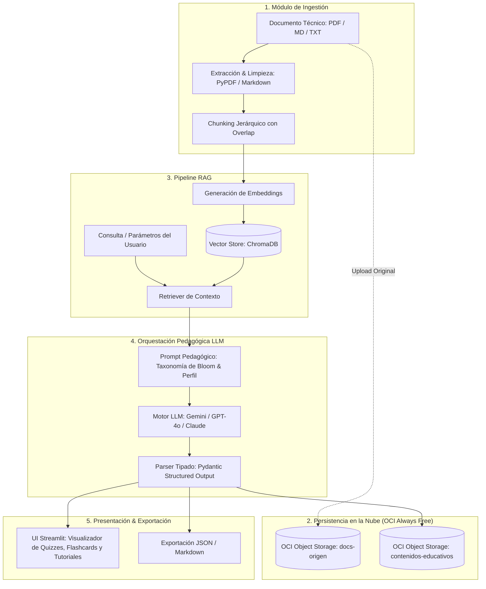

# 🎓 NuevaMente — Sistema Inteligente de Adaptación y Generación de Contenido Educativo

[](https://www.oracle.com/lad/education/oracle-next-education/)
[](https://www.python.org/)
[](https://www.oracle.com/cloud/free/)
[](https://streamlit.io/)

---

## 📌 Visión General
**NuevaMente** es una solución inteligente diseñada para el sector **EdTech y Capacitación Corporativa**. Su objetivo es ingerir documentaciones técnicas complejas (manuales de software, especificaciones de arquitectura, artículos) y transformarlas automáticamente en contenidos educativos interactivos y personalizados.

La plataforma utiliza un pipeline **RAG (Retrieval-Augmented Generation)** anclado en fuentes técnicas para evitar alucinaciones, orquesta modelos fundacionales de lenguaje (Google Gemini, OpenAI, Claude) y persiste tanto los materiales de origen como las evaluaciones y resultados en **Oracle Cloud Infrastructure (OCI) Object Storage** bajo la capa **Always Free**.

---

## 🏗️ Arquitectura del Sistema



---

## 🎯 Criterios de Personalización Educativa

| Dimensión | Opciones Soportadas |
| :--- | :--- |
| **Perfil del Destinatario** | • Principiante / Transición de Carrera<br>• Desarrollador Junior / Semi Senior<br>• Líder Técnico / Arquitecto<br>• Gestor / Ejecutivo (No Técnico) |
| **Formato Pedagógico** | • Guía Práctica Paso a Paso (Tutorial)<br>• Flashcards de Memorización con pistas didácticas<br>• Quiz Interactivo con justificaciones de respuestas<br>• Resumen Ejecutivo (TL;DR)<br>• Guion de Clase o Video |
| **Nicho / Contexto** | Fintech, Salud, E-commerce, Infraestructura Cloud, General |
| **Nivel de Detalle** | Didáctico, Técnico profundo, Estratégico |

---

## 📋 Estructura de Salida JSON Estructurada
El pipeline garantiza el tipado estricto mediante Pydantic y retorna el esquema oficial del hackathon:

```json
{
  "status": "exito",
  "metadatos": {
    "perfil_aplicado": "Principiante",
    "formato_generado": "Flashcards",
    "tiempo_estimado_estudio_minutos": 5,
    "conceptos_clave": ["VCN", "Subredes", "Internet Gateway", "Security Lists"]
  },
  "contenido_adaptado": {
    "titulo": "Dominando Redes en la Nube (VCN) desde Cero",
    "introduccion_contextualizada": "Analogía contextualizada para principiantes...",
    "items": [
      {
        "frente": "¿Qué es una VCN en Oracle Cloud?",
        "dorso": "Es tu red virtual privada y personalizada dentro de la nube de Oracle...",
        "pista_didactica": "Piensa en ella como el terreno cercado donde residen tus servidores."
      }
    ]
  },
  "evaluacion_calidad": {
    "anclaje_fuente_score": 0.98,
    "claridad_pedagogica": "Alta",
    "observaciones": "Lenguaje ajustado con analogías para público principiante."
  },
  "almacenamiento_oci": {
    "bucket": "nuevamente-contenidos-educativos",
    "objeto_id": "contenido-vcn-principiante-flashcards-001.json",
    "status_upload": "completado"
  }
}
```

---

## 🚀 Guía de Inicio Rápido

### 1. Clonar el Repositorio
```bash
git clone https://github.com/mmorfe-engineer/nuevamente_g10_latam.git
cd nuevamente
```

### 2. Crear y Activar el Entorno Virtual
```bash
python3 -m venv venv
source venv/bin/activate
```

### 3. Instalar Dependencias
```bash
pip install -r requirements.txt
```

### 4. Configurar Variables de Entorno
```bash
cp .env.example .env
# Configura tus API Keys de LLM (Gemini / OpenAI) y credenciales de OCI
```

### 5. Iniciar la Interfaz Web
```bash
streamlit run ui/app.py
```

---

## 👥 Equipo del Proyecto (Hackathon ONE G10 - No Country)

- **Martin Morfe** — *Project Manager*
- **Esteban Guillermo Morales Velazquez** — *Software / Solution Architect*
- **Juan David Villegas Anaya** — *Backend Developer*
- **Harol Benjamin Medina Zárate** — *Full Stack Developer*
- **Heiner Jair Godoy Zamora** — *Full Stack Developer*
- **Cristian Contreras** — *Frontend Developer*
- **Diana Castaño** — *Frontend Developer*
- **Ivan Hernandez** — *DevOps Engineer*

---

## 📄 Licencia
Este proyecto fue desarrollado con fines educativos y de impacto social bajo el marco de **Oracle Next Education (ONE)** y **Alura Latam**.
