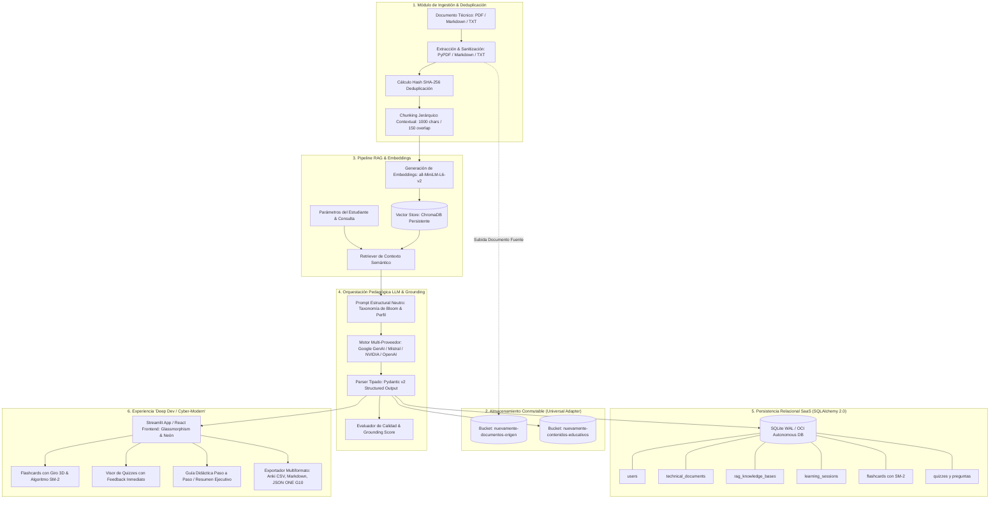

# 🎓 NuevaMente — Sistema Inteligente de Adaptación y Generación de Contenido Educativo

[](https://www.oracle.com/lad/education/oracle-next-education/)
[-red?style=for-the-badge&logo=oracle)](https://www.oracle.com/cloud/free/)
[-brightgreen?style=for-the-badge&logo=pytest)](https://docs.pytest.org/)
[](https://langchain-ai.github.io/langgraph/)
[](https://www.python.org/)
[](https://nuevamente.streamlit.app)
[](https://aws.amazon.com/s3/)
[](https://en.wikipedia.org/wiki/SuperMemo#SM-2_algorithm)

> 🚀 **PROTOTIPO DE REFERENCIA ASÍNCRONO v4 COMPLETADO Y CERTIFICADO**  
> Para la guía de adopción técnica por parte del equipo de desarrollo, consulta el [📦 Paquete de Transferencia Técnica para Squad 1](docs/PAQUETE_TRANSFERENCIA_PROYECTO_1.md) con la secuencia canónica de 12 commits, procedimiento de almacenamiento, bitácora de trampas resueltas y los 4 contratos JSON de referencia en [docs/contratos_referencia/](docs/contratos_referencia/).

---

## 📌 Visión General
**NuevaMente** es una plataforma SaaS EdTech de alto impacto desarrollada en el marco del **Hackathon ONE Grupo 10 (Oracle Next Education & Alura / No Country)**. Su misión es democratizar y acelerar el aprendizaje técnico ingiriendo documentaciones canónicas de alta densidad (manuales de arquitectura cloud, normativas de ingeniería, guías de ciberseguridad, especificaciones NIST, CIS y PCI-DSS) y transformándolas de manera automática en contenidos pedagógicos hiper-personalizados según el perfil cognitivo del estudiante, aplicando la **Taxonomía de Bloom**, la **Andragogía Laboral de Malcolm Knowles** y retención activa medible mediante el algoritmo **SuperMemo SM-2**.

La solución garantiza **fidelidad técnica rigurosa y mitigación total de alucinaciones** a través de:
1. **Principio de Independencia del Corpus:** El dominio temático es dato de entrada, jamás arquitectura fija. Probado con éxito en Cloud OCI, Ciberseguridad y Manufactura Industrial (`tests/test_cross_corpus_domain.py`).
2. **Evaluación de Anclaje a la Fuente (`anclaje_fuente_score >= 0.85`):** Ponderación algorítmica de retención conceptual y similitud semántica.
3. **Regla de Nomenclatura Parentética Bilingüe:** `Término en Español [Término Canónico en Inglés]` para preservar correspondencia con la consola de Oracle Cloud.
4. **Adaptador Universal de Almacenamiento:** Conmutación sin fricción entre almacenamiento local, S3 compatible y OCI Object Storage Always Free.

---

## 🏗️ Arquitectura Integral del Sistema (C4 / Mermaid)



---

## 🎯 Cuatro Parámetros de Control (Requisito O-13)

| Dimensión | Opciones Soportadas | Enfoque Pedagógico |
| :--- | :--- | :--- |
| **1. Perfil del Destinatario** | • **Principiante**<br>• **Desarrollador Junior**<br>• **Arquitecto / Líder Técnico**<br>• **Ejecutivo / Gestor** | Calibración de sobrecarga cognitiva, metáforas cotidianas vs sistémicas, y profundidad técnica vs impacto de negocio. |
| **2. Formato Didáctico** | • **Flashcards 3D de Memorización**<br>• **Tutorial Paso a Paso (Guía Práctica)**<br>• **Resumen Ejecutivo (TL;DR)**<br>• *Quiz Interactivo Reactivo (Modo Avanzado)*<br>• *Guion de Video Didáctico (Modo Avanzado)* | Estructuras instruccionales alineadas a la **Taxonomía de Bloom** (Recordar, Comprender, Aplicar, Evaluar). |
| **3. Sector / Nicho (10 Sectores Canónicos)** | 1. Ciberseguridad & Gobernanza<br>2. Fintech & Banca Digital<br>3. Salud & Tecnología Médica (MedTech)<br>4. E-commerce & Retail Tech<br>5. Cloud & Infraestructura de TI<br>6. Manufactura e Ingeniería Industrial<br>7. Telecomunicaciones & Redes<br>8. LegalTech & Cumplimiento Normativo<br>9. EdTech & Formación Corporativa<br>10. General / Interdisciplinario | Contextualización semántica de analogías y casos reales al ámbito laboral específico. |
| **4. Nivel de Detalle** | • **Didáctico (Introductorio / Formativo)**<br>• **Técnico Profundo (Implementación)**<br>• **Estratégico (Gobernanza / Negocio)** | Regulación de la densidad analítica y complejidad del contenido generado. |

---

## 📦 Estructura de Salida JSON Estructurada (Pliego ONE G10)

```json
{
  "status": "exito",
  "metadatos": {
    "perfil_aplicado": "Principiante",
    "formato_generado": "Flashcards",
    "tiempo_estimado_estudio_minutos": 15,
    "conceptos_clave": [
      "Virtual Cloud Network (VCN) [Red Virtual en la Nube (VCN)]",
      "Subredes públicas y privadas",
      "Internet Gateway y NAT Gateway",
      "Security Lists [Listas de Seguridad]"
    ],
    "prerrequisitos": [
      "Conocimiento básico de redes informáticas",
      "Entendimiento de conceptos como IP, subred y firewall",
      "Familiaridad con Cloud Computing"
    ]
  },
  "contenido_adaptado": {
    "titulo": "Virtual Cloud Network (VCN) en OCI: Conceptos Básicos para Principiantes",
    "introduccion_contextualizada": "Imagina que necesitas crear tu propia oficina en la nube...",
    "items": [
      {
        "frente": "¿Qué es una Virtual Cloud Network (VCN) [Red Virtual en la Nube (VCN)]?",
        "dorso": "La VCN es una red privada y personalizable configurada en Oracle Cloud Infrastructure (OCI)...",
        "pista_didactica": "Piensa en la VCN como tu 'oficina en la nube': tú decides quién entra y cómo se organizan los equipos."
      }
    ]
  },
  "evaluacion_calidad": {
    "anclaje_fuente_score": 0.88,
    "claridad_pedagogica": "Alta",
    "observaciones": "Contenido adaptado para perfil Principiante. Anclaje riguroso en fuentes técnicas originales."
  },
  "almacenamiento_oci": {
    "bucket": "nuevamente-contenidos-educativos",
    "objeto_id": "contenido-introduccion-a-la-ar-principiante-flashcards-069c21.json",
    "status_upload": "completado"
  }
}
```

---

## 🔄 Conmutación Universal de Almacenamiento

El sistema conmuta de backend físico con una sola variable en `.env`:

```bash
# Opción A: Modo Local (Sin credenciales de red, almacena en ./data/storage_local/)
STORAGE_PROVIDER=local

# Opción B: Modo S3 Compatible (MinIO, Cloudflare R2, AWS S3 o Emulador)
STORAGE_PROVIDER=s3_compatible
OCI_S3_ENDPOINT_URL=https://<tenant_id>.compat.objectstorage.<region>.oraclecloud.com
OCI_S3_ACCESS_KEY_ID=<tu_access_key>
OCI_S3_SECRET_ACCESS_KEY=<tu_secret_key>

# Opción C: Modo OCI Nativo (Producción Always Free con OCI SDK)
STORAGE_PROVIDER=oci_native
OCI_CONFIG_FILE=~/.oci/config
```

---

## 🧪 Matriz de Verificación de Criterios (O-01 a O-14 + X-01)

| Criterio | Descripción | Estado | Evidencia |
| :--- | :--- | :---: | :--- |
| **O-01** | Ingesta PDF, Markdown y Texto Plano | 🟢 VERIFICADO | `src/ingestion/loaders.py` · `tests/test_ingestion.py` |
| **O-02** | Limpieza y normalización de texto conservando terminología | 🟢 VERIFICADO | `src/ingestion/loaders.py` (`clean_text`) · `tests/test_ingestion.py` |
| **O-03** | Orquestación con LLM (Google Gemini) | 🟡 PENDIENTE | Cliente migrado a `google-genai` en `src/llm/engine.py`; ejecución viva pendiente de provisión de `GEMINI_API_KEY` por el squad. |
| **O-04** | Pipeline RAG: chunking 1000/150, embeddings y vector store | 🟢 VERIFICADO | `src/ingestion/chunker.py` · `src/rag/vector_store.py` (ChromaDB) |
| **O-05** | Mismo documento adaptado a al menos 2 perfiles y 2 formatos | 🟢 VERIFICADO | Vinculado a Contrato 01 (Principiante Flashcards) y Contrato 02 (Arquitecto Tutorial) en `docs/contratos_referencia/` |
| **O-06** | Formatos mínimos (Flashcards, Tutorial y Resumen) | 🟢 VERIFICADO | `src/schemas/adaptation.py` · `tests/test_schemas.py` |
| **O-07** | Metadatos de aprendizaje con tiempo, conceptos y prerrequisitos | 🟢 VERIFICADO | `MetadatosAprendizaje` en `src/schemas/adaptation.py` |
| **O-08** | Control de alucinaciones con anclaje a la fuente | 🟢 VERIFICADO | `src/quality/evaluator.py` (`anclaje_fuente_score >= 0.85`) |
| **O-09** | Salida forzada en JSON estructurado y tipado | 🟢 VERIFICADO | `src/llm/engine.py` (validación Pydantic estricta con `RespuestaAdaptacion`) |
| **O-10** | Manejo de excepciones defensivo ante caídas del LLM | 🟢 VERIFICADO | Cadena multi-proveedor: Google GenAI ➔ Mistral ➔ NVIDIA NIM ➔ OpenAI ➔ Sintético |
| **O-11** | Almacenamiento en OCI Object Storage Always Free | 🟠 EXCEPCIÓN | Documentada y certificada en `docs/EXCEPCION_ALMACENAMIENTO_OCI.md`. Adaptador conmutable con prueba archivada |
| **O-12** | Mínimo de 3 ejemplos de ejecución documentados | 🟢 VERIFICADO | Contratos 01, 02 y 03 versionados en `docs/contratos_referencia/` |
| **O-13** | Interfaz de usuario con los 4 parámetros de control | 🟢 VERIFICADO | `ui/app.py` (Perfil, Formato, 10 Sectores Canónicos, Nivel de Detalle) |
| **O-14** | Suite de pruebas automatizadas que valide el flujo completo | 🟢 VERIFICADO | 46 pruebas automatizadas passing en `tests/` (`pytest tests/ -v`) |
| **X-01** | Independencia del corpus con sector no relacionado | 🟢 VERIFICADO | Sector 6 Manufactura en `tests/test_cross_corpus_domain.py` y `docs/INFORME_INDEPENDENCIA_CORPUS.md` |

---

## 🚀 Guía de Inicio Rápido

```bash
# 1. Clonar el repositorio
git clone https://github.com/bitcoinpapa-dev/nuevamente.git
cd nuevamente

# 2. Entorno virtual e instalación de dependencias
python3 -m venv venv
source venv/bin/activate
pip install -r requirements.txt

# 3. Configuración de entorno
cp .env.example .env
# Configura tus API keys según disponibilidad (STORAGE_PROVIDER=local por defecto)

# 4. Ejecutar la suite de pruebas
pytest tests/ -v

# 5. Levantar la aplicación de referencia
streamlit run ui/app.py
```

---

## 👥 Equipo del Proyecto (Hackathon ONE G10 · No Country)

- **Martin Morfe** — *Project Manager & Coordinador General*
- **Esteban Guillermo Morales Velazquez** — *Software & Solution Architect (@Lead-Architect)*
- **Juan David Villegas Anaya** — *Backend & AI Developer (@Backend-AI-Dev)*
- **Harol Benjamin Medina Zárate** — *Cloud & Data Developer (@Cloud-Data-Dev)*
- **Heiner Jair Godoy Zamora** — *Cloud & Data Developer (@Cloud-Data-Dev)*
- **Cristian Contreras** — *Frontend & UI Developer (@Frontend-UI-Dev)*
- **Diana Castaño** — *Frontend & UI Developer (@Frontend-UI-Dev)*
- **Ivan Hernandez** — *DevOps & QA Engineer (@QA-DevOps-Dev)*

---

## 📄 Licencia y Marco Académico
Desarrollado con fines de impacto social y democratización formativa en América Latina bajo el programa **Oracle Next Education (ONE Grupo 10)**, **Alura Latam** y **No Country**.
