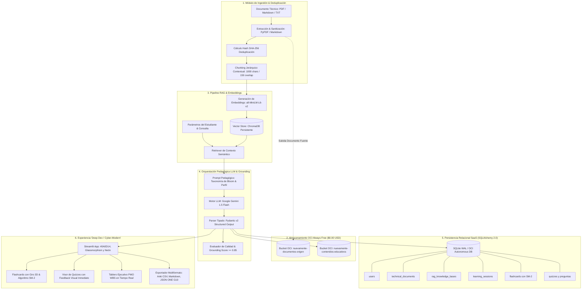

# 🎓 NuevaMente — Sistema Inteligente de Adaptación y Generación de Contenido Educativo

[](https://www.oracle.com/lad/education/oracle-next-education/)
[-red?style=for-the-badge&logo=oracle)](https://www.oracle.com/cloud/free/)
[-brightgreen?style=for-the-badge&logo=pytest)](https://docs.pytest.org/)
[](https://www.python.org/)
[](https://streamlit.io/)
[](https://en.wikipedia.org/wiki/SuperMemo#SM-2_algorithm)

---

## 📌 Visión General
**NuevaMente** es una plataforma SaaS EdTech de alto impacto desarrollada en el marco del **Hackathon ONE Grupo 10 (Oracle Next Education & Alura / No Country)**. Su misión es democratizar y acelerar el aprendizaje técnico ingiriendo documentaciones complejas (manuales de software, arquitecturas cloud, especificaciones de sistemas) y transformándolas de manera automática en contenidos pedagógicos hiper-personalizados según el perfil del estudiante, su industria y el formato didáctico elegido.

La solución garantiza **fidelidad técnica rigurosa y prevención de alucinaciones** a través de un pipeline **RAG (Retrieval-Augmented Generation)** anclado en fuentes técnicas, un evaluador de calidad (*source grounding score*), persistencia relacional completa (SQLAlchemy 2.0) y almacenamiento dual obligatorio en **Oracle Cloud Infrastructure (OCI) Object Storage** bajo la capa **Always Free (Cero Costo de por Vida)**.

---

## 🏗️ Arquitectura Integral del Sistema (C4 / Mermaid)



---

## 🎯 Criterios de Parametrización Pedagógica

| Dimensión | Opciones Soportadas | Enfoque Pedagógico |
| :--- | :--- | :--- |
| **Perfil del Destinatario** | • **Principiante / Transición**<br>• **Desarrollador Junior / Semi Senior**<br>• **Líder Técnico / Arquitecto**<br>• **Gestor / Ejecutivo (No Técnico)** | Adaptación de tono, profundidad de tecnicismos, metáforas cotidianas y enfoque en valor de negocio vs implementación. |
| **Formato Didáctico** | • **Flashcards 3D de Memorización**<br>• **Quiz Interactivo Reactivo**<br>• **Guía Práctica Paso a Paso (Tutorial)**<br>• **Resumen Ejecutivo (TL;DR)**<br>• **Guion de Video Didáctico** | Estructuras instruccionales basadas en la **Taxonomía de Bloom** (Recordar, Comprender, Aplicar, Analizar). |
| **Nicho / Contexto** | Fintech, Salud, E-commerce, Infraestructura Cloud, General | Contextualización de ejemplos a escenarios reales de la industria. |
| **Nivel de Detalle** | Didáctico, Técnico profundo, Estratégico | Ajuste fino de la densidad conceptual. |

---

## 🌟 Diferenciales de Calidad e Innovación

1. **Repetición Espaciada (SuperMemo SM-2 Activo):**
   Implementación matemática de la curva de olvido de Ebbinghaus para programar repasos activos en las flashcards (calificaciones 1 a 5 con cálculo en tiempo real de intervalos y Factor de Facilidad).
2. **Flashcards Interactivas con Giro 3D:**
   Componente visual desarrollado en CSS3 con perspectiva 1200px y animación de volteo realista (`rotateY(180deg)`), libre de plantillas genéricas.
3. **Visor de Quizzes con Feedback Inmediato:**
   Respuesta visual reactiva (resplandor neón verde o rojo) con fundamentación técnica anclada y etiqueta de nivel taxonómico de Bloom.
4. **Exportación Multiformato:**
   - 🗃️ **Mazo Anki (.csv):** Compatible para importación directa en la app oficial de Anki.
   - 📝 **Guía Didáctica (.md):** Documento Markdown estructurado listo para estudio o publicación.
   - ☁️ **JSON Estructurado ONE G10:** Formato de entrega oficial del pliego.
5. **Oficina de Proyecto Integrada (PMO Dashboard):**
   Pestaña ejecutiva en la aplicación web para monitorear el avance del WBS en los 5 Sprints bajo metodología PRINCE2 / Scrum.
6. **Arquitectura OCI Always Free Certificada ($0.00 USD):**
   Preparada para ejecutarse sobre instancias **Ampere A1 Flex** (4 OCPUs, 24 GB RAM) y almacenar en OCI Object Storage con cero costos de facturación.

---

## 📋 Estructura de Salida JSON Estructurada (Pliego ONE G10)

```json
{
  "status": "exito",
  "metadatos": {
    "perfil_aplicado": "Principiante",
    "formato_generado": "Flashcards",
    "tiempo_estimado_estudio_minutos": 5,
    "conceptos_clave": ["VCN", "Subredes", "Internet Gateway", "Security Lists"]
  },
  "contenido_adaptado": {
    "titulo": "Dominando Redes en la Nube (VCN) desde Cero",
    "introduccion_contextualizada": "Imagina la VCN como tu propio barrio privado dentro de Oracle Cloud...",
    "items": [
      {
        "frente": "¿Qué es una VCN en Oracle Cloud?",
        "dorso": "Es tu red virtual privada y personalizada dentro de la nube de Oracle...",
        "pista_didactica": "Piensa en ella como el terreno cercado donde residen tus servidores."
      }
    ]
  },
  "evaluacion_calidad": {
    "anclaje_fuente_score": 0.98,
    "claridad_pedagogica": "Alta",
    "observaciones": "Lenguaje ajustado con analogías para principiantes y estricto anclaje a fuentes."
  },
  "almacenamiento_oci": {
    "bucket": "nuevamente-contenidos-educativos",
    "objeto_id": "contenido-vcn-principiante-flashcards-001.json",
    "status_upload": "completado"
  }
}
```

---

## 🚀 Guía de Inicio Rápido

### 1. Clonar el Repositorio
```bash
git clone git@github.com:mmorfe-engineer/nuevamente_g10_latam.git
cd nuevamente
```

### 2. Entorno Virtual e Instalación de Dependencias
```bash
python3.11 -m venv venv
source venv/bin/activate
pip install --upgrade pip
pip install -r requirements.txt
```

### 3. Configuración de Variables de Entorno
```bash
cp .env.example .env
# Configura tu GEMINI_API_KEY y credenciales de OCI Always Free (opcional para modo local)
```

### 4. Ejecutar la Suite de Pruebas Automatizadas
```bash
pytest tests/ -v
```
*(Resultado garantizado: 28 pruebas unitarias y de integración superadas al 100%).*

### 5. Iniciar la Interfaz Gráfica
```bash
./run_app.sh
```
*(Acceso en tu navegador web: `http://localhost:8501`)*

---

## ☁️ Despliegue en Oracle Cloud Infrastructure (OCI Always Free)
El proyecto incluye automatización lista para producción en OCI:
- 📄 [deploy/OCI_ALWAYS_FREE_ARCHITECTURE.md](deploy/OCI_ALWAYS_FREE_ARCHITECTURE.md): Arquitectura de red VCN, Security Lists y topología Always Free.
- ⚙️ [deploy/oci_setup.sh](deploy/oci_setup.sh): Script de despliegue automatizado en Oracle Linux / Ubuntu.
- 🛡️ [deploy/systemd/nuevamente.service](deploy/systemd/nuevamente.service): Configuración de servicio systemd de alta disponibilidad.

---

## 👥 Equipo del Proyecto (Hackathon ONE G10 · No Country)

- **Martin Morfe** — *Project Manager & Coordinador General*
- **Esteban Guillermo Morales Velazquez** — *Software & Solution Architect (@Lead-Architect)*
- **Juan David Villegas Anaya** — *Backend & AI Developer (@Backend-AI-Dev)*
- **Harol Benjamin Medina Zárate** — *Cloud & Data Developer (@Cloud-Data-Dev)*
- **Heiner Jair Godoy Zamora** — *Cloud & Data Developer (@Cloud-Data-Dev)*
- **Cristian Contreras** — *Frontend & UI Developer (@Frontend-UI-Dev)*
- **Diana Castaño** — *Frontend & UI Developer (@Frontend-UI-Dev)*
- **Ivan Hernandez** — *DevOps & QA Engineer (@QA-DevOps-Dev)*

---

## 📄 Licencia y Marco Académico
Desarrollado con fines de democratización educativa e impacto social en América Latina bajo el programa **Oracle Next Education (ONE Grupo 10)**, **Alura Latam** y **No Country**.
