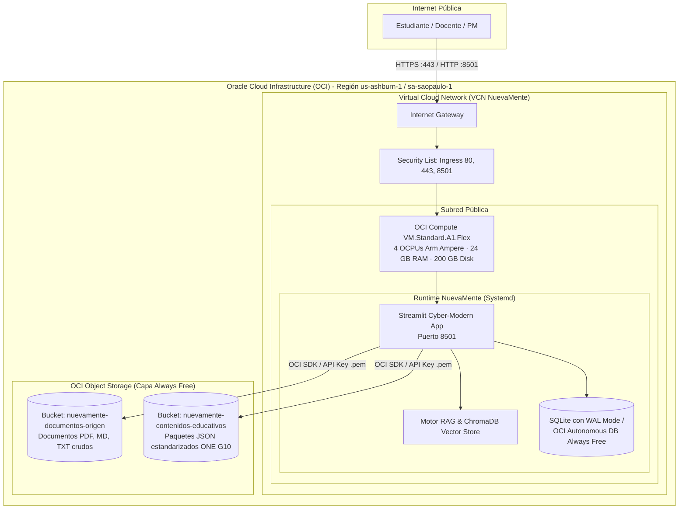

# Arquitectura de Despliegue en Oracle Cloud Infrastructure (OCI Always Free)
## Proyecto: 🎓 NuevaMente — Hackathon ONE G10 (Oracle Next Education & No Country)

---

## 1. Visión General de la Infraestructura en OCI

NuevaMente ha sido diseñado y optimizado para operar con rendimiento empresarial dentro de los límites estrictos de la capa **OCI Always Free (Cero Costo de por Vida)**, validando suficiencia técnica y gobernanza en la nube de Oracle.



---

## 2. Inventario de Recursos OCI Always Free Utilizados

| Recurso OCI | Especificación Asignada | Cuota Always Free | Costo Mensual |
| :--- | :--- | :--- | :---: |
| **Compute Instance** | VM.Standard.A1.Flex (4 OCPU, 24 GB RAM) | 4 OCPUs y 24 GB RAM gratis de por vida | **\$0.00 USD** |
| **Boot Volume** | 100 GB Paravirtualized Block Volume | 200 GB gratuitos entre volúmenes | **\$0.00 USD** |
| **VCN & Redes** | 1 VCN (10.0.0.0/16), 1 Subred, 1 Internet Gateway | Incluido en Always Free | **\$0.00 USD** |
| **Object Storage (Origen)** | `nuevamente-documentos-origen` (Documentos raw) | Hasta 10 GB de almacenamiento estándar | **\$0.00 USD** |
| **Object Storage (Salida)** | `nuevamente-contenidos-educativos` (JSON ONE G10) | Hasta 10 GB de almacenamiento estándar | **\$0.00 USD** |
| **API Requests** | Subidas y consultas vía OCI SDK Python | Hasta 50,000 llamadas API al mes | **\$0.00 USD** |
| **Base de Datos** | SQLite 3 en modo WAL (en volumen NVMe OCI) | 0 costo adicional / Embebida de alto IOPS | **\$0.00 USD** |

---

## 3. Instrucciones de Despliegue en la Instancia OCI

### 3.1. Requisitos Previos en la Consola de OCI
1. Crear Compartimento: `NuevaMente_Compartment`.
2. Crear los dos Buckets en **Object Storage**:
   - `nuevamente-documentos-origen`
   - `nuevamente-contenidos-educativos`
3. Crear Clave API de Usuario en OCI:
   - Ir a Perfil de Usuario -> Claves de API -> Agregar Clave de API.
   - Descargar la clave privada (`oci_api_key.pem`) y copiar el bloque de configuración (`[DEFAULT]`).

### 3.2. Aprovisionamiento de la Máquina Virtual (Compute)
1. Lanzar Instancia en **Compute -> Instances -> Create Instance**.
2. Imagen: **Oracle Linux 9** o **Ubuntu 22.04 LTS**.
3. Configuración de recursos (Shape): **Ampere VM.Standard.A1.Flex** (4 OCPU, 24 GB RAM).
4. Subir llave pública SSH y asociar la VCN pública.
5. En la Security List de la VCN, agregar regla de entrada (Ingress Rule):
   - **CIDR Origen:** `0.0.0.0/0`
   - **Protocolo IP:** TCP
   - **Rango de Puertos de Destino:** `8501, 80, 443`

---

## 4. Servicio Systemd para Alta Disponibilidad (`nuevamente.service`)

Para garantizar que la plataforma NuevaMente se ejecute 24/7 y se reinicie automáticamente ante reinicios de la máquina virtual de OCI:

```ini
[Unit]
Description=NuevaMente EdTech RAG Platform (Streamlit)
After=network.target

[Service]
User=opc
WorkingDirectory=/home/opc/nuevamente
ExecStart=/home/opc/nuevamente/venv/bin/streamlit run ui/app.py --server.port 8501 --server.address 0.0.0.0 --server.headless true
Restart=always
RestartSec=5
Environment=PATH=/home/opc/nuevamente/venv/bin:/usr/bin
EnvironmentFile=/home/opc/nuevamente/.env

[Install]
WantedBy=multi-user.target
```
