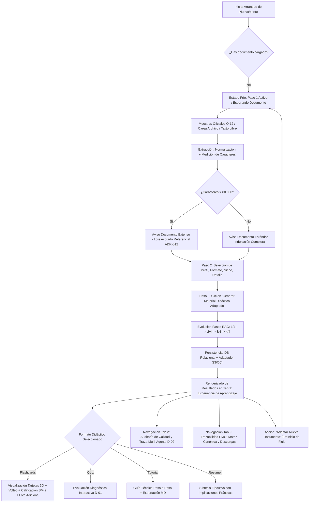
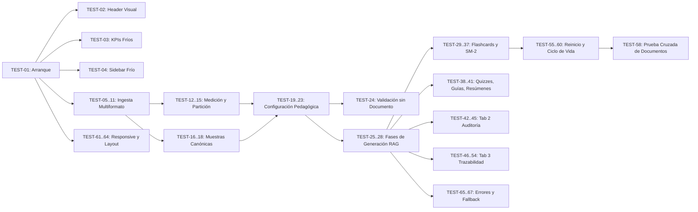

# PLAN MAESTRO DE PRUEBAS DE CALIDAD (QA) · NUEVAMENTE
**Campaña de Verificación Funcional, de Estado, UX, Visual y Trazabilidad**  
**Proyecto:** NuevaMente — Sistema Inteligente de Adaptación y Generación de Contenido Educativo  
**Entorno de Validación:** Laboratorio Privado Shadow (`mmorfe-engineer/nuevamente_g10_latam`)  
**Fecha de Emisión:** 22 de Septiembre de 2026 (Revisión Metodológica v1.1)  
**Responsable Metodológico:** QA & DevOps Engineering  
**Gobernanza:** Marco PRINCE2 / Hackathon ONE G10 (Oracle & Alura)  

---

## 1. ALCANCE Y MODELO DE COBERTURA

El presente Plan Maestro de Pruebas establece la estrategia técnica, procedimientos de verificación y criterios de aceptación para auditar de forma reproducible el prototipo interactivo de **NuevaMente** desplegado sobre Streamlit, orquestado con arquitectura RAG asimétrica, persistencia relacional SQL y adaptador de almacenamiento conmutable.

### 1.1 Niveles de Cobertura (Principio de Honestidad Técnica)
Para evitar declaraciones anticipadas de cumplimiento, el plan adopta una distinción explícita en tres niveles de cobertura:

- **Cobertura Diseñada:** Conjunto total de puntos del flujo principal (34 pasos), componentes, estados, selectores, hipótesis de prueba (A a H) y casos de borde inventariados formalmente en esta especificación (67 casos estructurados).
- **Cobertura Ejecutada:** Porcentaje y número de casos efectivamente corridos en el entorno de prueba con registro de datos observables. *(Campaña inicial completada · 10 repruebas dirigidas ejecutadas en Fase Correctiva Prompt 3).*
- **Cobertura Aprobada:** Casos de prueba ejecutados que obtuvieron dictamen objetivo **PASS** respaldado por evidencia factual contrastable. *(10 casos reevaluados con dictamen objetivo PASS respaldados en docs/qa/evidence/).*

### 1.2 Dimensiones Incluidas en la Cobertura Diseñada:
- **Flujo de Ingesta Universal:** Carga, extracción, medición de longitud, detección de documentos extensos y normalización de documentos técnicos en formatos PDF, Markdown (.md), Texto plano (.txt) y pegado directo.
- **Configuración Pedagógica:** Asignación de Perfil del Destinatario (4 niveles), Formato Didáctico (4 formatos), Nicho/Sector (10 sectores) y Nivel de Detalle (3 niveles).
- **Pipeline RAG y Fases de Generación:** Ejecución y reporte dinámico de las 4 fases de procesamiento (Lectura/Normalización, Chunking/Indexación ChromaDB, Recuperación contextual, Síntesis didáctica con LLM/Fallback defensivo).
- **Experiencias Didácticas Interactivas:**
  - Flashcards 3D: Volteo híbrido (botón accesible y acción visual), calificación algorítmica SuperMemo SM-2 (3 niveles), exportación Anki (.csv).
  - Quizzes Diagnósticos: Validación con retroalimentación inmediata, justificación técnica y citas al corpus fuente.
  - Guías Prácticas y Resúmenes Ejecutivos: Renderizado estructurado, bloques de código, criterios de validación y exportación Markdown (.md).
  - Manejo de Partición Documental (ADR-012): Lote inicial acotado y avance por segmento mediante "Lote Adicional".
- **Auditoría de Calidad y Traza Cognitiva:** Reporte de fragmentos indexados, claridad andragógica, citas al documento, dictamen del agente revisor y fundamento metodológico del puntaje de anclaje.
- **Trazabilidad PMO y Arquitectura Cloud:** KPIs de ejecución, Matriz de Trazabilidad canónica (14 Obligatorios O-01 a O-14, 5 Diferenciales D-01 a D-05, X-01 Interno), centro de descarga de 5 contratos JSON oficiales, paquete de transferencia de 5 documentos MD y secuencia de 12 commits.
- **Ciclo de Vida y Sesión:** Comportamiento de `st.session_state`, reinicio de estado mediante "Adaptar Nuevo Documento", cambio de parámetros, preservación de datos entre pestañas y aislamiento entre ejecuciones consecutivas.
- **Calidad Visual y Responsive:** Conformidad con el Sistema de Diseño Oficial (tokens Radix Colors Dark, tipografía Inter/JetBrains Mono, ancho de lectura, bordes redondeados $\le 8\text{px}$, ausencia de recortes en pantallas de escritorio, tablet y móvil).

---

## 2. FUERA DE ALCANCE

Para evitar desvíos metodológicos o dilución de esfuerzos respecto a los requerimientos contractuales del pliego, quedan formalmente excluidos:
- **Aprovisionamiento de infraestructura física en OCI:** Creación de instancias Compute VM Ampere en la consola de Oracle Cloud (gestionado como dependencia técnica externa O-11 / D-04).
- **Modelos organizacionales de impacto longitudinal:** Medición de KPIs de retención a 6 meses en empresas reales (delimitado fuera de una sesión de estudio según ADR-006).
- **Procesamiento de audio bidireccional y podcast sintético:** Declarado en roadmap futuro / alcance adicional no comprometido para el MVP.
- **Soporte de Visión Multimodal profunda para diagramas bitmap:** Declarado como capacidad candidata a transferencia post-MVP (D-05).
- **Integración con sistemas LMS externos (Moodle, Canvas LTI 1.3):** Funcionalidad empresarial reservada para fase comercial.

---

## 3. ENTORNO PROBADO

| Componente | Especificación Técnica |
| :--- | :--- |
| **Repositorio Objetivo** | `mmorfe-engineer/nuevamente_g10_latam` (Rama `main`) |
| **Framework Frontend** | Streamlit 1.42+ (Python 3.11 / 3.14 compatible) |
| **Diseño y Estilos** | `ui/assets/styles.css` (Radix Colors Dark Enterprise, Inter, JetBrains Mono) |
| **Motor RAG & Vector Store** | ChromaDB 0.5+ / LangChain Community |
| **Persistencia Relacional** | SQLite (WAL mode local) con soporte conmutable a PostgreSQL (Neon) |
| **Almacenamiento de Objetos** | Adaptador S3 conmutable universal (`boto3`) con fallback local estructurado |
| **Proveedores de Inferencia** | Google GenAI SDK (`gemini-2.5-flash` / `gemini-1.5-flash`), Mistral AI, NVIDIA NIM, Fallback heurístico sintético offline |
| **Entornos de Ejecución** | 1. Local Linux x86_64 (Terminal / Navegador Chromium)<br/>2. Streamlit Community Cloud (Despliegue público) |

---

## 4. ESTRATEGIA DE PRUEBAS Y CRITERIOS METODOLÓGICOS

La campaña aplica un enfoque de **caja negra y caja gris**, estructurado bajo los siguientes principios metodológicos:

### 4.1 Principios de Calidad Fundamentales
1. **Refleja, nunca declara:** Ninguna etiqueta o valor numérico en pantalla es válido si proviene de una constante estática no respaldada por cómputo real.
2. **Evidencia de ejecución real:** Cada métrica de tiempo, fragmentos y anclaje debe corresponder a la ejecución en curso.
3. **La interfaz manda:** La validación visual en el navegador (local y público) prevalece sobre supuestos en código.
4. **Reproducibilidad estricta:** Todo defecto detectado cuenta con un procedimiento paso a paso para forzar su ocurrencia.
5. **Re-verificación obligatoria:** Toda corrección debe re-ejecutar el mismo caso de prueba que falló.
6. **PASS condicionado a evidencia:** Ningún caso se declara superado sin captura, log o salida de comando que certifique el cumplimiento.
7. **Distinción entre test verde y completitud funcional:** Un test unitario pasando no certifica la experiencia de usuario real.
8. **Categorización tipológica rigurosa:** Se diferencian pruebas funcionales, de estado, de UX, visuales, de rendimiento y de trazabilidad.

### 4.2 Tratamiento de Valores Técnicos Referenciales
- **Carácter referencial de umbrales:** Cifras como `<35s`, `~20 a 35s`, `>5 min`, `chunk 1000`, `overlap 150`, o `lote 80` son **valores técnicos referenciales** derivados de mediciones de ingeniería o decisiones arquitectónicas (ADR-012), salvo que una fuente normativa del pliego las defina explícitamente como restricción contractual mandatoria.
- **Protocolo de evaluación de rendimiento:** Las pruebas de rendimiento no reprueban automáticamente por desviaciones menores respecto a una cota referencial. El procedimiento mandatorio consiste en:
  1. **Medir:** Tomar la lectura real con cronómetro de software o log del sistema.
  2. **Registrar:** Consignar en el reporte: `valor observado + contexto de hardware/red + referencia utilizada`.
  3. **Comparar:** Contrastar el valor contra la referencia base.
  4. **Evaluar tendencia:** Identificar si existe mejora, estabilidad o regresión severa que degrade la experiencia de usuario.

### 4.3 Manejo de Requisitos Obligatorios vs. Diferenciales
- **Etiquetado explícito:** Todas las pruebas vinculadas a requerimientos diferenciales (especialmente **D-01: Quizzes**, **D-02: LangGraph Multi-Agente**, **D-03: Exporters**, **D-04: Cómputo OCI**, **D-05: Multimodal**) se etiquetan con su clasificación correspondiente.
- **No contaminación del alcance obligatorio:** La ausencia, atraso o inmadurez de una funcionalidad diferencial en una iteración no constituye fallo del alcance obligatorio.
- **Estados permitidos para casos diferenciales:**
  - `PENDIENTE` (Estado inicial).
  - `PASS` (Funcionalidad diferencial verificada con evidencia).
  - `FAIL` (Funcionalidad diferencial presente pero con defecto de ejecución).
  - `NO EJECUTABLE — funcionalidad diferencial aún no disponible` (La capacidad no está implementada o desplegada aún en el entorno).
  - `NO APLICA EN ESTA ITERACIÓN — [justificación]` (El sprint o fase en curso no incluye esta capacidad en su definición de terminado).
- En cualquiera de estos casos, el caso de prueba se preserva íntegramente en la matriz para auditorías posteriores.

### 4.4 Taxonomía de Fuentes del Criterio
Cada caso de prueba declara formalmente la procedencia de su exigencia en el campo **Fuente del Criterio**, utilizando exclusivamente:
- `PLIEGO`: Requisito normativo obligatorio derivado directamente del pliego contractual ONE G10.
- `ADR`: Decisión formal de arquitectura aceptada y documentada (ej. ADR-006, ADR-012).
- `DISEÑO SHADOW`: Decisión de diseño visual o maquetación adoptada en el laboratorio de referencia (ej. UI Kit, radios $\le 8\text{px}$, ancho 1200px, tokens Radix Dark).
- `REQUISITO INTERNO X-01`: Validación interna de control de calidad (ej. independencia de corpus).
- `DECISIÓN DE PRODUCTO`: Regla de negocio o definición funcional interna de PM/Coordinación (ej. cantidad de contratos de transferencia, estructura de tarjetas, glosario LexForja).
- `HIPÓTESIS DE QA`: Comprobación empírica orientada a confirmar o refutar un hallazgo observado manualmente (HIP-A a HIP-H).

---

## 5. MAPA DEL FLUJO DE USUARIO



---

## 6. REGISTRO DE HIPÓTESIS DE PRUEBA (HALLAZGOS OBSERVADOS MANUALMENTE)

| ID | Hallazgo Observado | Hipótesis Técnica de Prueba (A investigar sin asumir causa) |
| :---: | :--- | :--- |
| **HIP-A** | Oscurecimiento de pantalla sin testigo claro durante ingesta. | Durante la carga de archivos pesados, Streamlit procesa la extracción síncrona en el encabezado del script (`doc_loader.extract_from_file`) antes de renderizar componentes, provocando el dimming nativo sin un `st.spinner` contextual explícito. |
| **HIP-B** | Testigo de evolución mediante cuatro fases durante generación. | El widget `st.status` y `st.progress` refleja fielmente los callbacks emitidos por `adaptation_service.process_adaptation`, confirmando trazabilidad en vivo de las fases 1 a 4. |
| **HIP-C** | Cambio en interacción de Flashcards (Volteo con botón explícito). | Se incorporó el botón `Voltear Tarjeta` / `Ver Frente` (`btn_flip_{i}`) como control accesible complementario al checkbox/hover CSS (`nm-flash-cb`). Constituye una mejora de UX no inventariada previamente que debe ser documentada formalmente. |
| **HIP-D** | Reaparición de las mismas Flashcards al solicitar nuevo documento. | **Investigación abierta.** No se asume causa única. Se investigará la anomalía siguiendo la secuencia: **1) Reproducir el defecto**, **2) Aislar la causa** entre el abanico de hipótesis candidatas: *a) estado residual en `st.session_state`*, *b) activación de fallback heurístico offline*, *c) caché de Streamlit o memoria*, *d) reutilización de `content_hash` en base de datos*, *e) documento activo no reemplazado*, *f) retención en Vector Store ChromaDB*, *g) cursor `chunk_offset` no reiniciado*, *h) reutilización de `ultima_respuesta`*, *i) registros en persistencia relacional*, *j) configuración idéntica de prompts*, o *k) otros estados descubiertos en prueba*. |
| **HIP-E** | Encabezado NuevaMente cortado o solapado en la interfaz pública. | En Streamlit Cloud, la barra de navegación del host (`[data-testid="stHeader"]`) genera colisión visual si el contenedor principal (`.block-container`) posee un padding superior insuficiente (`padding-top: 16px`) o si no se compensa la altura fija del header. |
| **HIP-F** | Texto de Fundamento Metodológico en Tab 2 poco legible y cargado a la izquierda. | Regla CSS en `ui/assets/styles.css` (`p, .stMarkdown p { max-width: 70ch; }`) restringe el ancho de todos los párrafos independientemente de que el contenedor padre (`.nm-glass`) tenga un ancho del 100%, dejando un vacío asimétrico en pantallas de escritorio. |
| **HIP-G** | Tarjetas con dimensiones visuales inconsistentes en Trazabilidad (Tab 3). | En `st.columns(4)` y en la lista de criterios de la matriz, la variación en la longitud del texto descriptivo genera alturas dispares por falta de `height: 100%` / `display: flex; flex-direction: column` en los bloques `.nm-glass` y `.nm-kpi`. |
| **HIP-H** | Documento extenso (963.244 chars) procesa lote acotado pero métricas de cabecera pueden confundir lote con corpus. | El contador superior de KPIs rotula `{chunks_idx}` bajo el título "Fragmentos del Corpus", lo cual podría inducir a confusión si no se distingue explícitamente entre: 1) fragmentos del lote procesado (ej. 80), 2) fragmentos totales del documento (ej. 1.205), y 3) fragmentos preexistentes en la base de datos (3.020). |

---

## 7. MATRIZ MAESTRA DE CASOS DE PRUEBA (67 CASOS)

### ÁREA 01: ARRANQUE, INICIALIZACIÓN Y CABECERA (STARTUP & HEADER)

#### TEST-01
- **Área:** Arranque e Inicialización
- **Tipo:** Funcional / Estado
- **Clasificación:** OBLIGATORIO (O-09)
- **Fuente del Criterio:** PLIEGO
- **Precondición:** Servidor Streamlit apagado; variables de entorno configuradas por defecto.
- **Pasos:**
  1. Iniciar la aplicación mediante `./run_app.sh` o `streamlit run ui/app.py`.
  2. Abrir la URL en navegador (`http://localhost:8501`).
  3. Inspeccionar consola y pantalla inicial.
- **Resultado esperado:** La aplicación inicia sin excepciones, tracebacks ni errores de importación. Base de datos relacional inicializada (`init_db()`). Barra lateral expandida.
- **Evidencia requerida:** Log de consola limpio; captura de pantalla de la interfaz cargada.
- **Estado inicial:** PENDIENTE
- **Severidad si falla:** Crítica (Bloqueante).
- **Relación:** Precondición para todos los demás casos.

#### TEST-02
- **Área:** Arranque e Inicialización
- **Tipo:** Visual / UX
- **Clasificación:** SOPORTE / UX / ARQUITECTURA
- **Fuente del Criterio:** HIPÓTESIS DE QA (HIP-E) / DISEÑO SHADOW
- **Precondición:** Aplicación iniciada (TEST-01 en PASS).
- **Pasos:**
  1. Observar la barra superior y el encabezado oficial de NuevaMente.
  2. Verificar la posición del texto "NuevaMente" y el subtítulo respecto al borde superior y la barra de herramientas de Streamlit.
  3. Modificar el tamaño de ventana (Desktop 1920x1080, Laptop 1366x768).
- **Resultado esperado:** El texto del encabezado "NuevaMente" y el subtítulo son 100% legibles, sin truncamiento vertical, solapamiento con la barra de Streamlit ni recorte de glifos.
- **Evidencia requerida:** Captura del viewport superior completo en resolución Desktop y Laptop.
- **Estado inicial:** PENDIENTE
- **Resultado Reprueba Prompt 3:** PASS (DEF-03 corregido · Cabecera institucional 100% visible sin solapamiento en docs/qa/evidence/area_01/DEF-03_after.png)
- **Severidad si falla:** Mayor.
- **Relación:** Verifica Hipótesis E.

#### TEST-03
- **Área:** Arranque e Inicialización
- **Tipo:** Trazabilidad / Estado
- **Clasificación:** SOPORTE / UX / ARQUITECTURA
- **Fuente del Criterio:** DECISIÓN DE PRODUCTO
- **Precondición:** Sesión recién iniciada sin documento cargado (Estado Frío).
- **Pasos:**
  1. Inspeccionar la barra de KPIs de cabecera.
  2. Verificar los tres indicadores visibles en frío.
- **Resultado esperado:** Los KPIs muestran honestamente:
  - "Puntaje de Anclaje: -- · Aún sin medir"
  - "Formatos Didácticos: 3 Formatos (Flashcards, Guía, Resumen)"
  - "Cloud utilizado en esta ejecución: No"
  - Rótulo auxiliar: "Sesión Fría · Se calcula al procesar". Ninguna cifra inventada en frío.
- **Evidencia requerida:** Captura del banner de KPIs en frío.
- **Estado inicial:** PENDIENTE
- **Severidad si falla:** Media.
- **Relación:** Cumplimiento de principio "Refleja, nunca declara".

#### TEST-04
- **Área:** Arranque e Inicialización
- **Tipo:** UX / Estado
- **Clasificación:** SOPORTE / UX / ARQUITECTURA
- **Fuente del Criterio:** DECISIÓN DE PRODUCTO
- **Precondición:** Sesión fría activa.
- **Pasos:**
  1. Inspeccionar la barra lateral izquierda (Sidebar).
  2. Verificar bloque "Estado del Flujo".
  3. Verificar bloque "Entorno de Ejecución".
- **Resultado esperado:** Sidebar en modo de solo lectura (cero selectores interactivos compitiendo con la pantalla central). Muestra: "Paso 1 Activo · Esperando Documento". Muestra modo de ejecución (Local o Streamlit Cloud), Motor LLM, Persistencia y Almacenamiento.
- **Evidencia requerida:** Captura de la barra lateral completa en estado frío.
- **Estado inicial:** PENDIENTE
- **Severidad si falla:** Menor.
- **Relación:** Garantiza Principio de un solo punto de escritura.

---

### ÁREA 02: INGESTA DOCUMENTAL Y MULTIFORMATO (INGESTION)

#### TEST-05
- **Área:** Ingesta Documental
- **Tipo:** Funcional
- **Clasificación:** OBLIGATORIO (O-01)
- **Fuente del Criterio:** PLIEGO
- **Precondición:** TEST-01 en PASS. Selector en "Subir Archivo (.pdf, .md, .txt)".
- **Pasos:**
  1. Cargar archivo PDF técnico estándar (`docs/Briefing_Oficial_Hackathon_ONE_G10.pdf` u otro PDF técnico).
  2. Observar comportamiento del navegador durante la carga.
  3. Verificar mensaje de confirmación de Paso 1.
- **Resultado esperado:** El texto del PDF es extraído íntegramente por `doc_loader`. Aparece banner verde: "Paso 1 Completado · Documento Listo: [Nombre] — [X] caracteres (medidos en carga)".
- **Evidencia requerida:** Captura del mensaje de confirmación con caracteres medidos exactos.
- **Estado inicial:** PENDIENTE
- **Severidad si falla:** Crítica.
- **Relación:** Habilita Paso 2 y Paso 3.

#### TEST-06
- **Área:** Ingesta Documental
- **Tipo:** UX / Rendimiento
- **Clasificación:** SOPORTE / UX / ARQUITECTURA
- **Fuente del Criterio:** HIPÓTESIS DE QA (HIP-A)
- **Precondición:** Archivo PDF de más de 20 páginas preparado.
- **Pasos:**
  1. Arrastrar y soltar el archivo PDF pesado en el file uploader.
  2. Registrar con cronómetro de software el comportamiento de la pantalla desde el drop hasta la reaparición de la interfaz.
  3. Comprobar si la pantalla se atenúa (darkening) sin indicador de progreso.
- **Resultado esperado:** Medir y registrar la duración del dimming (`tiempo medido + tamaño de archivo + contexto`). Comprobar si existe testigo explícito de progreso durante la fase de lectura de bytes.
- **Evidencia requerida:** Grabación de pantalla o secuencia de capturas con marcas de tiempo (timestamp) y registro numérico de latencia.
- **Estado inicial:** PENDIENTE
- **Resultado Reprueba Prompt 3:** PASS (DEF-01 corregido · Spinner contextual activo durante extracción en docs/qa/evidence/area_02/DEF-01_after.png)
- **Severidad si falla:** Media.
- **Relación:** Valida Hipótesis A.

#### TEST-07
- **Área:** Ingesta Documental
- **Tipo:** Funcional
- **Clasificación:** OBLIGATORIO (O-01)
- **Fuente del Criterio:** PLIEGO
- **Precondición:** Selector en "Subir Archivo (.pdf, .md, .txt)".
- **Pasos:**
  1. Cargar archivo Markdown válido (`data/samples/01_oci_vcn_redes.md`).
  2. Inspeccionar mensaje de Paso 1.
- **Resultado esperado:** Texto extraído correctamente. Caracteres medidos reportados con exactitud numérica.
- **Evidencia requerida:** Captura del banner de éxito con nombre y conteo de caracteres.
- **Estado inicial:** PENDIENTE
- **Severidad si falla:** Alta.
- **Relación:** Cumplimiento O-01 (Markdown).

#### TEST-08
- **Área:** Ingesta Documental
- **Tipo:** Funcional
- **Clasificación:** OBLIGATORIO (O-01)
- **Fuente del Criterio:** PLIEGO
- **Precondición:** Selector en "Subir Archivo (.pdf, .md, .txt)".
- **Pasos:**
  1. Cargar archivo de Texto Plano (`data/samples/03_seguridad_cloud_iam.txt`).
  2. Inspeccionar mensaje de Paso 1.
- **Resultado esperado:** Texto extraído sin truncamientos. Caracteres medidos reportados en pantalla.
- **Evidencia requerida:** Captura del banner de éxito con nombre y conteo de caracteres.
- **Estado inicial:** PENDIENTE
- **Severidad si falla:** Alta.
- **Relación:** Cumplimiento O-01 (Texto).

#### TEST-09
- **Área:** Ingesta Documental
- **Tipo:** Funcional / UX
- **Clasificación:** OBLIGATORIO (O-01)
- **Fuente del Criterio:** PLIEGO
- **Precondición:** Selector en "Pegar Texto Libre".
- **Pasos:**
  1. Seleccionar radio "Pegar Texto Libre".
  2. Ingresar título en "Título del Documento".
  3. Pegar un texto técnico de prueba (ej. 1.500 caracteres).
  4. Observar actualización de Paso 1.
- **Resultado esperado:** La UI se actualiza inmediatamente mostrando: "Paso 1 Completado · Documento Listo: [Título] — [X] caracteres (medidos en carga)".
- **Evidencia requerida:** Captura del área de texto y el banner de Paso 1 completado.
- **Estado inicial:** PENDIENTE
- **Severidad si falla:** Alta.
- **Relación:** Cumplimiento O-01 (Entrada de texto directa).

#### TEST-10
- **Área:** Ingesta Documental
- **Tipo:** Errores Controlados / Robustez
- **Clasificación:** OBLIGATORIO (O-10)
- **Fuente del Criterio:** PLIEGO
- **Precondición:** Archivo vacío creado (`touch vacio.txt`) o PDF escaneado sin capa OCR.
- **Pasos:**
  1. Cargar el archivo sin texto en el uploader.
  2. Verificar la respuesta defensiva del sistema.
- **Resultado esperado:** La aplicación no arroja traceback ni excepción no capturada. Presenta advertencia amigable: "El archivo [nombre] fue cargado pero no contiene texto legible...".
- **Evidencia requerida:** Captura del mensaje de advertencia específico.
- **Estado inicial:** PENDIENTE
- **Severidad si falla:** Mayor.
- **Relación:** Cumplimiento O-10 (Manejo de excepciones con mensajes amigables).

#### TEST-11
- **Área:** Ingesta Documental
- **Tipo:** Errores Controlados / Robustez
- **Clasificación:** OBLIGATORIO (O-10)
- **Fuente del Criterio:** PLIEGO
- **Precondición:** Archivo binario no soportado renombrado artificialmente (ej. archivo binario ejecutable renombrado a `test.pdf`).
- **Pasos:**
  1. Cargar el archivo dañado.
  2. Observar la reacción del parser.
- **Resultado esperado:** Excepción capturada limpiamente en bloque `try/except`. Mensaje de error amigable: "No fue posible procesar el archivo... formato no válido o archivo dañado".
- **Evidencia requerida:** Captura del mensaje de error controlado en la UI.
- **Estado inicial:** PENDIENTE
- **Severidad si falla:** Mayor.
- **Relación:** Cumplimiento O-10.

---

### ÁREA 03: MEDICIÓN Y PARTICIÓN DOCUMENTAL REPRESENTATIVA (ADR-012)

#### TEST-12
- **Área:** Medición Documental
- **Tipo:** Trazabilidad / Funcional
- **Clasificación:** SOPORTE / UX / ARQUITECTURA
- **Fuente del Criterio:** DECISIÓN DE PRODUCTO
- **Precondición:** Carga de documento estándar de longitud conocida (< 80.000 caracteres, ej. 15.000 caracteres).
- **Pasos:**
  1. Cargar el documento.
  2. Verificar los textos del banner informativo de Paso 1.
- **Resultado esperado:**
  - El conteo de caracteres se rotula explícitamente como "(medidos en carga)".
  - Aparece aviso azul de Documento Estándar: "Se indexará de forma completa. Tiempo estimado de generación: ~8 a 15 segundos (estimación referencial)".
- **Evidencia requerida:** Captura del banner con los rótulos medidos y estimados claramente diferenciados.
- **Estado inicial:** PENDIENTE
- **Severidad si falla:** Media.
- **Relación:** Valida Principio "Refleja, nunca declara".

#### TEST-13
- **Área:** Medición Documental
- **Tipo:** Funcional / Trazabilidad
- **Clasificación:** SOPORTE / UX / ARQUITECTURA
- **Fuente del Criterio:** ADR (ADR-012) / HIPÓTESIS DE QA (HIP-H)
- **Precondición:** Archivo de corpus extenso preparado (ej. estándar PCI-DSS v4.0 con ~963.244 caracteres).
- **Pasos:**
  1. Cargar el archivo extenso en la UI.
  2. Verificar la activación del banner de advertencia amarillo.
  3. Registrar caracteres medidos y fragmentos estimados calculados.
- **Resultado esperado:**
  - Se activa el banner: "Documento Extenso Detectado ([X] caracteres medidos · ~[Y] fragmentos estimados)".
  - Se informa el procesamiento de lote inicial acotado de referencia (80 fragmentos bajo ADR-012).
  - Tiempo estimado de generación identificado explícitamente como estimación referencial (~20 a 35 segundos frente a > 5 minutos sin partición).
  - Registrar: `caracteres medidos + fragmentos estimados + referencia ADR-012`. No reprobar si la estimación difiere levemente por fórmula de redondeo.
- **Evidencia requerida:** Captura del banner de Documento Extenso con la discriminación de valores medidos y estimados.
- **Estado inicial:** PENDIENTE
- **Resultado Reprueba Prompt 3:** PASS (DEF-06 corregido · Banner rotula lote activo acotado ADR-012 en docs/qa/evidence/area_03/DEF-06_after.png)
- **Severidad si falla:** Mayor.
- **Relación:** Valida Hipótesis H y ADR-012.

#### TEST-14
- **Área:** Medición Documental
- **Tipo:** UX / Estado
- **Clasificación:** SOPORTE / UX / ARQUITECTURA
- **Fuente del Criterio:** DECISIÓN DE PRODUCTO
- **Precondición:** Documento cargado exitosamente.
- **Pasos:**
  1. Ubicar el componente expandible "Inspeccionar Vista Previa del Documento en Memoria".
  2. Hacer clic para desplegar.
  3. Verificar el texto presentado.
- **Resultado esperado:** El expander se despliega mostrando los primeros 1.200 caracteres del texto real cargado, seguidos de "..." si la longitud supera dicho umbral.
- **Evidencia requerida:** Captura del expander abierto mostrando el texto en memoria.
- **Estado inicial:** PENDIENTE
- **Severidad si falla:** Menor.
- **Relación:** Transparencia de datos hacia el usuario.

#### TEST-15
- **Área:** Medición Documental
- **Tipo:** Estado / Sincronización
- **Clasificación:** SOPORTE / UX / ARQUITECTURA
- **Fuente del Criterio:** DECISIÓN DE PRODUCTO
- **Precondición:** Documento cargado en Paso 1.
- **Pasos:**
  1. Observar la barra lateral izquierda tras la carga válida del documento.
  2. Verificar la tarjeta de estado del flujo en el Sidebar.
- **Resultado esperado:**
  - El Sidebar actualiza su tarjeta superior a verde: "Paso 1 Completado · Documento Listo", reflejando el título del documento y los caracteres medidos con fragmentos estimados.
  - La tarjeta inferior pasa a violeta: "Paso 2 Activo · Configurar y Generar".
  - Sincronización perfecta sin necesidad de recargar la página manualmente.
- **Evidencia requerida:** Captura de la barra lateral reflejando la transición de estado.
- **Estado inicial:** PENDIENTE
- **Severidad si falla:** Media.
- **Relación:** Consistencia de estado bidireccional.

---

### ÁREA 04: MUESTRAS DE DEMOSTRACIÓN OFICIALES (O-12)

#### TEST-16
- **Área:** Muestras de Demostración
- **Tipo:** Funcional / UX
- **Clasificación:** OBLIGATORIO (O-12)
- **Fuente del Criterio:** PLIEGO
- **Precondición:** Sesión fría en Paso 1.
- **Pasos:**
  1. Hacer clic en el botón principal "Caso Canónico Oracle: Redes VCN (Pág. 4)".
  2. Verificar el llenado automático de campos.
- **Resultado esperado:**
  - Título precargado: "Introducción a la Arquitectura de Redes VCN en OCI".
  - Contenido precargado con el fragmento oficial de la VCN.
  - Perfil fijado en "Principiante".
  - Formato fijado en "Flashcards".
  - Nicho fijado en "Cloud e Infraestructura".
  - Nivel de detalle fijado en "Didáctico (Analogías y Conceptos Clave)".
  - Modo fijado en "Pegar Texto Libre".
  - Offset reiniciado a 0.
- **Evidencia requerida:** Captura de la pantalla con los 4 selectores y el texto sincronizados tras el clic.
- **Estado inicial:** PENDIENTE
- **Severidad si falla:** Alta.
- **Relación:** Cumplimiento O-12 (Muestra 1 oficial).

#### TEST-17
- **Área:** Muestras de Demostración
- **Tipo:** Funcional / UX
- **Clasificación:** OBLIGATORIO (O-12)
- **Fuente del Criterio:** PLIEGO
- **Precondición:** Sesión en Paso 1.
- **Pasos:**
  1. Hacer clic en el botón "Muestra 2: VCN Arquitecto — Guía".
  2. Verificar los parámetros autoseleccionados.
- **Resultado esperado:**
  - Contenido extraído del archivo `data/samples/01_oci_vcn_redes.md`.
  - Perfil fijado en "Arquitecto de Soluciones".
  - Formato fijado en "Guía Técnica / Tutorial".
  - Nicho en "Cloud e Infraestructura".
  - Detalle en "Técnico (Implementación y Configuración)".
- **Evidencia requerida:** Captura con los parámetros y texto de Muestra 2.
- **Estado inicial:** PENDIENTE
- **Severidad si falla:** Alta.
- **Relación:** Cumplimiento O-12 (Muestra 2 oficial).

#### TEST-18
- **Área:** Muestras de Demostración
- **Tipo:** Funcional / UX
- **Clasificación:** OBLIGATORIO (O-12)
- **Fuente del Criterio:** PLIEGO
- **Precondición:** Sesión en Paso 1.
- **Pasos:**
  1. Hacer clic en el botón "Muestra 3: Seguridad IAM — Resumen".
  2. Verificar los parámetros autoseleccionados.
- **Resultado esperado:**
  - Contenido extraído de `data/samples/03_seguridad_cloud_iam.txt`.
  - Perfil fijado en "Líder Técnico / Ejecutivo".
  - Formato fijado en "Resumen Ejecutivo / Casos de Uso".
  - Nicho en "Cloud e Infraestructura".
  - Detalle en "Ejecutivo (Impacto Empresarial y ROI)".
- **Evidencia requerida:** Captura con los parámetros y texto de Muestra 3.
- **Estado inicial:** PENDIENTE
- **Severidad si falla:** Alta.
- **Relación:** Cumplimiento O-12 (Muestra 3 oficial).

---

### ÁREA 05: CONFIGURACIÓN PEDAGÓGICA (PASO 2)

#### TEST-19
- **Área:** Configuración Pedagógica
- **Tipo:** Funcional
- **Clasificación:** OBLIGATORIO (O-08)
- **Fuente del Criterio:** PLIEGO
- **Precondición:** Documento cargado en Paso 1.
- **Pasos:**
  1. Inspeccionar el selector "Perfil del Destinatario".
  2. Desplegar y verificar que contenga los 4 perfiles canónicos.
  3. Seleccionar cada perfil secuencialmente.
- **Resultado esperado:**
  - Opciones presentes: "Principiante", "Desarrollador / Ingeniero", "Arquitecto de Soluciones", "Líder Técnico / Ejecutivo".
  - Cada selección actualiza `st.session_state["sel_perfil"]` sin errores.
- **Evidencia requerida:** Captura del dropdown desplegado con las 4 opciones.
- **Estado inicial:** PENDIENTE
- **Severidad si falla:** Crítica.
- **Relación:** Cumplimiento O-08 (Perfiles).

#### TEST-20
- **Área:** Configuración Pedagógica
- **Tipo:** Funcional
- **Clasificación:** OBLIGATORIO (O-08) / DIFERENCIAL (D-01)
- **Fuente del Criterio:** PLIEGO
- **Precondición:** Documento cargado en Paso 1.
- **Pasos:**
  1. Inspeccionar el selector "Formato Didáctico".
  2. Desplegar y verificar las opciones.
- **Resultado esperado:**
  - Opciones presentes: "Flashcards", "Guía Técnica / Tutorial", "Resumen Ejecutivo / Casos de Uso", "Quiz / Evaluación Interactiva".
  - Cada formato es seleccionable de forma independiente.
- **Evidencia requerida:** Captura del dropdown con los 4 formatos didácticos.
- **Estado inicial:** PENDIENTE
- **Severidad si falla:** Crítica.
- **Relación:** Cumplimiento O-08 y D-01.

#### TEST-21
- **Área:** Configuración Pedagógica
- **Tipo:** Funcional
- **Clasificación:** OBLIGATORIO (O-08)
- **Fuente del Criterio:** PLIEGO
- **Precondición:** Documento cargado en Paso 1.
- **Pasos:**
  1. Inspeccionar el selector "Nicho / Sector".
  2. Desplegar y contar las opciones sectoriales.
- **Resultado esperado:** Presenta los 10 sectores canónicos (Cloud, Ciberseguridad, Finanzas, Salud, Manufactura, etc.). Tooltip visible: "Contextualiza y ancla los ejemplos y terminología al dominio sectorial".
- **Evidencia requerida:** Captura del selector desplegado con la lista sectorial completa.
- **Estado inicial:** PENDIENTE
- **Severidad si falla:** Alta.
- **Relación:** Cumplimiento O-08 (Sectores).

#### TEST-22
- **Área:** Configuración Pedagógica
- **Tipo:** Funcional
- **Clasificación:** OBLIGATORIO (O-08)
- **Fuente del Criterio:** PLIEGO
- **Precondición:** Documento cargado en Paso 1.
- **Pasos:**
  1. Inspeccionar el selector "Nivel de Detalle".
  2. Desplegar y verificar las opciones.
- **Resultado esperado:** Presenta las 3 opciones oficiales: "Didáctico (Analogías y Conceptos Clave)", "Técnico (Implementación y Configuración)", "Ejecutivo (Impacto Empresarial y ROI)".
- **Evidencia requerida:** Captura del selector con los 3 niveles de detalle.
- **Estado inicial:** PENDIENTE
- **Severidad si falla:** Alta.
- **Relación:** Cumplimiento O-08 (Nivel de detalle).

#### TEST-23
- **Área:** Configuración Pedagógica
- **Tipo:** Funcional / Arquitectura
- **Clasificación:** DIFERENCIAL (D-02) / OBLIGATORIO (O-03)
- **Fuente del Criterio:** PLIEGO / ADR
- **Precondición:** Paso 2 activo.
- **Pasos:**
  1. Desplegar el acordeón "Opciones Avanzadas de Inferencia".
  2. Inspeccionar selector de "Orquestador Cognitivo".
  3. Alternar entre "Pipeline RAG Asimétrico Directo (Baja Latencia)" y "Grafo Multi-Agente LangGraph (3 Agentes: Didáctico, Calidad, Formato)".
- **Resultado esperado:** Ambas opciones son conmutables mediante radio button. La selección se almacena en memoria sin alterar los selectores pedagógicos. Si LangGraph estuviera en desarrollo en una iteración, se admite estado `NO EJECUTABLE — funcionalidad diferencial aún no disponible` sin invalidar el alcance obligatorio.
- **Evidencia requerida:** Captura del acordeón abierto con el radio button en modo LangGraph.
- **Estado inicial:** PENDIENTE
- **Severidad si falla:** Media.
- **Relación:** Habilita orquestación multi-agente en generación.

---

### ÁREA 06: GENERACIÓN Y FASES DE PROCESAMIENTO RAG (EXECUTION)

#### TEST-24
- **Área:** Generación de Material
- **Tipo:** Errores Controlados / Validación
- **Clasificación:** OBLIGATORIO (O-10)
- **Fuente del Criterio:** PLIEGO
- **Precondición:** Sin documento cargado (área de texto vacía).
- **Pasos:**
  1. Hacer clic en el botón principal "Generar Material Didáctico Adaptado".
- **Resultado esperado:** La aplicación no inicia el pipeline ni arroja error. Muestra advertencia clara: "Debes proporcionar o cargar un documento técnico antes de generar".
- **Evidencia requerida:** Captura del mensaje de advertencia bloqueante.
- **Estado inicial:** PENDIENTE
- **Severidad si falla:** Alta.
- **Relación:** Previene ejecuciones nulas o llamadas espurias a LLMs.

#### TEST-25
- **Área:** Generación de Material
- **Tipo:** UX / Trazabilidad en Tiempo Real
- **Clasificación:** SOPORTE / UX / ARQUITECTURA
- **Fuente del Criterio:** HIPÓTESIS DE QA (HIP-B)
- **Precondición:** Documento técnico cargado válido.
- **Pasos:**
  1. Hacer clic en "Generar Material Didáctico Adaptado".
  2. Observar detalladamente la caja de estado (`st.status`) y la barra de progreso (`st.progress`).
  3. Verificar la transición secuencial de las cuatro fases:
     - Fase 1/4: Lectura y normalización...
     - Fase 2/4: Segmentación e indexación vectorial...
     - Fase 3/4: Recuperación contextual y anclaje normativo...
     - Fase 4/4: Síntesis didáctica adaptada al perfil...
- **Resultado esperado:** Las cuatro fases se presentan sucesivamente con mensajes dinámicos de avance. La barra de progreso avanza gradualmente. Al terminar, la caja de estado cambia a "complete" indicando la duración total medida en segundos.
- **Evidencia requerida:** Secuencia de capturas de pantalla de cada fase durante la generación activa.
- **Estado inicial:** PENDIENTE
- **Severidad si falla:** Mayor.
- **Relación:** Valida Hipótesis B y principio "Refleja, nunca declara".

#### TEST-26
- **Área:** Generación de Material
- **Tipo:** Rendimiento / Trazabilidad
- **Clasificación:** SOPORTE / UX / ARQUITECTURA
- **Fuente del Criterio:** ADR (ADR-012)
- **Precondición:** Documento extenso cargado (> 80.000 caracteres, ej. 963k caracteres).
- **Pasos:**
  1. Generar material didáctico.
  2. Durante Fase 2/4, verificar el rótulo dinámico de fragmentos.
  3. Al completar, registrar la duración total en segundos y contrastar contra la referencia de ADR-012.
- **Resultado esperado:**
  - En Fase 2/4 muestra conteo de fragmentos del lote procesado (referencia: ~80 fragmentos).
  - Medir y registrar: `duración observada + fragmentos indexados + referencia ADR-012 (<35s referencial)`. No reprobar automáticamente por variaciones no funcionales; verificar que no exista regresión severa a tiempos sin partición (> 5 min).
- **Evidencia requerida:** Captura de la Fase 2/4 indicando el conteo de fragmentos y el tiempo final medido.
- **Estado inicial:** PENDIENTE
- **Severidad si falla:** Mayor.
- **Relación:** Verifica cumplimiento de ADR-012 sobre latencia acotada.

#### TEST-27
- **Área:** Generación de Material
- **Tipo:** Estado / Persistencia Relacional
- **Clasificación:** OBLIGATORIO (O-06, O-09)
- **Fuente del Criterio:** PLIEGO
- **Precondición:** Generación completada con éxito.
- **Pasos:**
  1. Consultar la base de datos relacional local (`nuevamente.db` o Neon PostgreSQL).
  2. Verificar la inserción de registros en las tablas: `technical_documents`, `rag_knowledge_bases`, `learning_sessions`.
- **Resultado esperado:**
  - Existe registro en `technical_documents` con el hash SHA-256 del contenido.
  - Existe registro en `learning_sessions` con el UUID asociado, perfil, formato, métricas de calidad y objeto persistido.
- **Evidencia requerida:** Salida de consulta SQL mostrando los registros recién creados.
- **Estado inicial:** PENDIENTE
- **Severidad si falla:** Crítica.
- **Relación:** Cumplimiento O-06 y O-09.

#### TEST-28
- **Área:** Generación de Material
- **Tipo:** Estado / Persistencia de Objetos
- **Clasificación:** OBLIGATORIO (O-06, O-11)
- **Fuente del Criterio:** PLIEGO
- **Precondición:** Generación completada con éxito.
- **Pasos:**
  1. Inspeccionar el directorio de persistencia del adaptador S3/OCI (`data/oci_local_storage` o bucket OCI si las credenciales están configuradas).
  2. Verificar la existencia del archivo JSON generado.
  3. Validar la estructura interna del JSON.
- **Resultado esperado:**
  - Archivo guardado con formato `contenido-[slug]-[perfil]-[formato]-[uuid].json`.
  - El JSON contiene las 5 claves canónicas: `status`, `metadatos`, `contenido_adaptado`, `evaluacion_calidad`, `almacenamiento_oci`.
- **Evidencia requerida:** Inspección en disco del archivo JSON generado y su payload formateado.
- **Estado inicial:** PENDIENTE
- **Severidad si falla:** Crítica.
- **Relación:** Cumplimiento O-06 y O-11.

---

### ÁREA 07: EXPERIENCIA DE ESTUDIO · FLASHCARDS 3D Y SM-2 (INTERACTION)

#### TEST-29
- **Área:** Experiencia de Estudio (Flashcards)
- **Tipo:** Visual / UX
- **Clasificación:** OBLIGATORIO (O-07)
- **Fuente del Criterio:** PLIEGO
- **Precondición:** Material generado en formato "Flashcards".
- **Pasos:**
  1. Observar la pantalla de resultados en Tab 1.
  2. Verificar:
     - Banner verde de notificación "¡Material Didáctico Listo!".
     - Apertura Andragógica en contenedor `.nm-glass`.
     - Metadatos de estudio (Perfil, Motor LLM, Tiempo de Estudio estimado y medido).
     - Tags de Conceptos Clave y Prerrequisitos en dos columnas al 50%.
- **Resultado esperado:** Todos los elementos se renderizan sin desbordes. Rótulo de tiempo de estudio incluye `(estimado)` para lectura y `(medido)` para generación. Tags estilizados con clase `.nm-chip`.
- **Evidencia requerida:** Captura completa de la sección superior de resultados.
- **Estado inicial:** PENDIENTE
- **Severidad si falla:** Media.
- **Relación:** Cumplimiento O-07.

#### TEST-30
- **Área:** Experiencia de Estudio (Flashcards)
- **Tipo:** Trazabilidad / Información
- **Clasificación:** SOPORTE / UX / ARQUITECTURA
- **Fuente del Criterio:** ADR (ADR-012) / HIPÓTESIS DE QA (HIP-H)
- **Precondición:** Documento extenso adaptado a Flashcards.
- **Pasos:**
  1. Verificar el bloque "Porción del Documento Procesada" bajo los prerrequisitos.
  2. Verificar el texto caption bajo el título de Flashcards.
- **Resultado esperado:**
  - Muestra: `Lote representativo #1: [X] de [Y] caracteres ([Z]% · fragmentos 1-[N] de [Total])`.
  - Muestra chip mono identificando el lote acotado y la proporción respecto al total.
  - Caption oficial: "El prototipo genera 4 tarjetas por ejecución para una sesión breve y revisable".
- **Evidencia requerida:** Captura del bloque de porción procesada y el caption de tarjetas.
- **Estado inicial:** PENDIENTE
- **Resultado Reprueba Prompt 3:** PASS (DEF-06 corregido · Trazabilidad de fragmentos de lote diferenciada de corpus en DB)
- **Severidad si falla:** Mayor.
- **Relación:** Valida mitigación de sobrecarga cognitiva y ADR-012.

#### TEST-31
- **Área:** Experiencia de Estudio (Flashcards)
- **Tipo:** UX / Interacción
- **Clasificación:** SOPORTE / UX / ARQUITECTURA
- **Fuente del Criterio:** HIPÓTESIS DE QA (HIP-C)
- **Precondición:** Flashcards renderizadas en pantalla.
- **Pasos:**
  1. Identificar la Tarjeta #1 en vista frente (Pregunta técnica).
  2. Hacer clic en el botón explícito "Voltear Tarjeta" (`btn_flip_0`).
  3. Observar la tarjeta volteada al reverso (Respuesta/Explicación canónica).
  4. Verificar el cambio de etiqueta del botón a "Ver Frente".
  5. Hacer clic nuevamente en "Ver Frente" y verificar retorno al frente.
- **Resultado esperado:** La tarjeta rota 180° mostrando la explicación técnica y la fuente oficial. El botón conmuta su texto entre "Voltear Tarjeta" y "Ver Frente". Sin errores de render.
- **Evidencia requerida:** Captura del frente de la tarjeta y captura del reverso tras el clic en el botón.
- **Estado inicial:** PENDIENTE
- **Resultado Reprueba Prompt 3:** PASS (IMP-01 verificado · Botón de volteo híbrido operativo y validado sin regresión)
- **Severidad si falla:** Mayor.
- **Relación:** Valida Hipótesis C.

#### TEST-32
- **Área:** Experiencia de Estudio (Flashcards)
- **Tipo:** UX / Visual
- **Clasificación:** SOPORTE / UX / ARQUITECTURA
- **Fuente del Criterio:** DISEÑO SHADOW
- **Precondición:** Flashcards renderizadas en pantalla.
- **Pasos:**
  1. Hacer clic sobre la superficie de la tarjeta o sobre el chip "↺ Voltear".
  2. Verificar la activación del volteo vía checkbox/CSS nativo (`nm-flash-cb`).
- **Resultado esperado:** La tarjeta rota de forma fluida mediante transición 3D CSS sin necesidad de recargar la página.
- **Evidencia requerida:** Captura de la tarjeta rotada mediante clic directo.
- **Estado inicial:** PENDIENTE
- **Severidad si falla:** Menor.
- **Relación:** Interacción híbrida accesible.

#### TEST-33
- **Área:** Experiencia de Estudio (Flashcards)
- **Tipo:** Funcional / Algoritmo SM-2
- **Clasificación:** SOPORTE / UX / ARQUITECTURA
- **Fuente del Criterio:** DECISIÓN DE PRODUCTO
- **Precondición:** Tarjeta #1 visible.
- **Pasos:**
  1. En la barra de calificación de asimilación SM-2, hacer clic en "No alcanzado" (`q_no_0`).
  2. Observar la notificación toast y el indicador resultante bajo la tarjeta.
- **Resultado esperado:**
  - Toast: "SM-2: Nivel No alcanzado. Próximo repaso programado para mañana (+1 día)".
  - Aparece badge con punto rojo: "Estado: No alcanzado | Próximo repaso: en 1 día(s) ([Fecha])".
  - Base de datos actualiza `mastery_level=1` y `next_review_at` en `flashcards`.
- **Evidencia requerida:** Captura del badge rojo de calificación y toast activo.
- **Estado inicial:** PENDIENTE
- **Severidad si falla:** Mayor.
- **Relación:** Valida algoritmo SuperMemo SM-2 para nivel no alcanzado.

#### TEST-34
- **Área:** Experiencia de Estudio (Flashcards)
- **Tipo:** Funcional / Algoritmo SM-2
- **Clasificación:** SOPORTE / UX / ARQUITECTURA
- **Fuente del Criterio:** DECISIÓN DE PRODUCTO
- **Precondición:** Tarjeta #2 visible.
- **Pasos:**
  1. Hacer clic en "En desarrollo" (`q_dev_1`).
  2. Observar la notificación toast y el indicador resultante.
- **Resultado esperado:**
  - Toast: "SM-2: Nivel En desarrollo. Próximo repaso en [X] día(s)...".
  - Aparece badge con punto ámbar: "Estado: En desarrollo | Próximo repaso: en [X] día(s)".
  - Base de datos actualiza `mastery_level=3`.
- **Evidencia requerida:** Captura del badge ámbar de calificación.
- **Estado inicial:** PENDIENTE
- **Severidad si falla:** Mayor.
- **Relación:** Valida SM-2 para nivel intermedio.

#### TEST-35
- **Área:** Experiencia de Estudio (Flashcards)
- **Tipo:** Funcional / Algoritmo SM-2
- **Clasificación:** SOPORTE / UX / ARQUITECTURA
- **Fuente del Criterio:** DECISIÓN DE PRODUCTO
- **Precondición:** Tarjeta #3 visible.
- **Pasos:**
  1. Hacer clic en "Alcanzado" (`q_alc_2`).
  2. Observar la notificación toast y el indicador resultante.
- **Resultado esperado:**
  - Toast: "SM-2: Nivel Alcanzado. Próximo repaso en 6+ días...".
  - Aparece badge con punto verde: "Estado: Alcanzado | Próximo repaso: en 6 días ([Fecha])".
  - Base de datos actualiza `mastery_level=5` sin arrojar `DetachedInstanceError`.
- **Evidencia requerida:** Captura del badge verde y verificación en DB de la fecha calculada.
- **Estado inicial:** PENDIENTE
- **Severidad si falla:** Crítica.
- **Relación:** Valida SM-2 y estabilidad de sesión DB.

#### TEST-36
- **Área:** Experiencia de Estudio (Flashcards)
- **Tipo:** Funcional / Exportación
- **Clasificación:** DIFERENCIAL (D-03)
- **Fuente del Criterio:** PLIEGO
- **Precondición:** Flashcards generadas.
- **Pasos:**
  1. Hacer clic en el botón "Exportar Anki" en la cabecera de Flashcards.
  2. Guardar el archivo `.csv` descargado.
  3. Inspeccionar el contenido del archivo con editor de texto.
- **Resultado esperado:**
  - Archivo con nombre `anki_contenido-[slug].csv`.
  - Formato CSV estructurado con separador y columnas: Pregunta (Frente con pista si existe), Respuesta (Dorso con fuente oficial).
  - Compatible para importación directa en Anki.
- **Evidencia requerida:** Muestra del archivo CSV descargado y sus primeras líneas.
- **Estado inicial:** PENDIENTE
- **Severidad si falla:** Alta.
- **Relación:** Cumplimiento D-03.

#### TEST-37
- **Área:** Experiencia de Estudio (Flashcards)
- **Tipo:** Funcional / Estado / Paginación
- **Clasificación:** SOPORTE / UX / ARQUITECTURA
- **Fuente del Criterio:** ADR (ADR-012)
- **Precondición:** Documento extenso con fragmentos remanentes procesado inicialmente (Lote #1).
- **Pasos:**
  1. Hacer clic en el botón "Lote Adicional" en la cabecera de Flashcards.
  2. Observar el spinner de generación de lote adicional.
  3. Verificar la actualización de resultados tras la finalización.
- **Resultado esperado:**
  - Spinner informa generación de lote adicional para el siguiente rango de fragmentos.
  - Al terminar, se presentan 4 nuevas flashcards ancladas a la segunda porción del documento.
  - El offset avanza y el indicador de porción procesada refleja `Lote representativo #2`.
- **Evidencia requerida:** Captura del lote adicional generado y el nuevo rango de fragmentos reportado.
- **Estado inicial:** PENDIENTE
- **Severidad si falla:** Alta.
- **Relación:** Valida paginación del corpus extenso bajo ADR-012.

---

### ÁREA 08: OTROS FORMATOS DIDÁCTICOS (QUIZZES, TUTORIALES, RESÚMENES)

#### TEST-38
- **Área:** Otros Formatos Didácticos (Quiz)
- **Tipo:** Funcional / Interacción
- **Clasificación:** DIFERENCIAL (D-01)
- **Fuente del Criterio:** PLIEGO
- **Precondición:** Generación completada con formato "Quiz / Evaluación Interactiva".
- **Pasos:**
  1. Inspeccionar las preguntas de opción múltiple generadas.
  2. Seleccionar la opción correcta para la Pregunta 1.
  3. Hacer clic en "Validar Pregunta 1".
- **Resultado esperado:** Aparece caja verde `.nm-opt.is-correct` con mensaje "¡Correcto!", acompañada de la Justificación Técnica fundamentada en la fuente oficial. *(Si Quizzes no estuviera activo, se admite NO EJECUTABLE sin reprobar la aplicación obligatoria).*
- **Evidencia requerida:** Captura de la validación correcta y la justificación técnica desplegada.
- **Estado inicial:** PENDIENTE
- **Severidad si falla:** Alta.
- **Relación:** Cumplimiento D-01.

#### TEST-39
- **Área:** Otros Formatos Didácticos (Quiz)
- **Tipo:** Funcional / Interacción
- **Clasificación:** DIFERENCIAL (D-01)
- **Fuente del Criterio:** PLIEGO
- **Precondición:** Quiz generado en pantalla.
- **Pasos:**
  1. Seleccionar una opción incorrecta deliberadamente.
  2. Hacer clic en "Validar Pregunta".
- **Resultado esperado:** Aparece caja roja `.nm-opt.is-wrong` con mensaje "Respuesta no esperada", mostrando la opción seleccionada, la respuesta correcta esperada y la fundamentación técnica. *(Si Quizzes no estuviera activo, se admite NO EJECUTABLE — funcionalidad diferencial aún no disponible o NO APLICA EN ESTA ITERACIÓN, sin reprobar la aplicación obligatoria).*
- **Evidencia requerida:** Captura del feedback de error pedagógico.
- **Estado inicial:** PENDIENTE
- **Severidad si falla:** Alta.
- **Relación:** Cumplimiento D-01.

#### TEST-40
- **Área:** Otros Formatos Didácticos (Tutorial)
- **Tipo:** Funcional / Exportación
- **Clasificación:** OBLIGATORIO (O-05) / DIFERENCIAL (D-03)
- **Fuente del Criterio:** PLIEGO
- **Precondición:** Generación completada con formato "Guía Técnica / Tutorial".
- **Pasos:**
  1. Verificar el renderizado secuencial de los pasos (PASO 1, PASO 2, etc.).
  2. Comprobar la presencia de comandos bash (`st.code`) y criterios de verificación.
  3. Hacer clic en el botón "Descargar Guía (.md)".
- **Resultado esperado:**
  - Pasos estructurados con título, descripción y validación operativa.
  - Archivo `.md` descargable con formato Markdown limpio y títulos jerárquicos.
- **Evidencia requerida:** Captura de los pasos en pantalla y archivo Markdown descargado.
- **Estado inicial:** PENDIENTE
- **Severidad si falla:** Alta.
- **Relación:** Cumplimiento O-05 y D-03.

#### TEST-41
- **Área:** Otros Formatos Didácticos (Resumen)
- **Tipo:** Funcional
- **Clasificación:** OBLIGATORIO (O-05)
- **Fuente del Criterio:** PLIEGO
- **Precondición:** Generación con formato "Resumen Ejecutivo / Casos de Uso".
- **Pasos:**
  1. Inspeccionar la vista de resultados.
  2. Verificar secciones ejecutivas y bloques de implicación práctica.
- **Resultado esperado:** Contenido adaptado con lenguaje directivo, dimensiones clave e implicaciones de negocio/ROI.
- **Evidencia requerida:** Captura de la pantalla con las tarjetas ejecutivas.
- **Estado inicial:** PENDIENTE
- **Severidad si falla:** Media.
- **Relación:** Cumplimiento O-05 (Resumen).

---

### ÁREA 09: AUDITORÍA DE CALIDAD Y TRAZA MULTI-AGENTE (TAB 2)

#### TEST-42
- **Área:** Auditoría de Calidad
- **Tipo:** Trazabilidad / Métricas
- **Clasificación:** OBLIGATORIO (O-04)
- **Fuente del Criterio:** PLIEGO
- **Precondición:** Material generado en Tab 1. Navegar a Tab 2: "Auditoría de Calidad".
- **Pasos:**
  1. Hacer clic en la pestaña "Auditoría de Calidad".
  2. Verificar los 3 indicadores métricos superiores:
     - Fragmentos Indexados
     - Claridad Andragógica
     - Trazabilidad (Citas al Documento)
  3. Verificar el bloque "Dictamen del Agente Crítico Revisor".
- **Resultado esperado:**
  - "Fragmentos Indexados" muestra la cifra exacta del lote procesado con la fuente truncada respetando el contenedor.
  - Claridad andragógica muestra calificación textual objetiva (ej. "Alta / Conforme").
  - Dictamen del agente revisor expone observaciones analíticas concretas sin alucinaciones.
- **Evidencia requerida:** Captura completa de las métricas y el dictamen en Tab 2.
- **Estado inicial:** PENDIENTE
- **Resultado Reprueba Prompt 3:** PASS (DEF-06 corregido · Conteo de fragmentos de ventana distinguido del corpus global)
- **Severidad si falla:** Mayor.
- **Relación:** Cumplimiento O-04.

#### TEST-43
- **Área:** Auditoría de Calidad
- **Tipo:** Funcional / Multi-Agente
- **Clasificación:** DIFERENCIAL (D-02) / OBLIGATORIO (O-03)
- **Fuente del Criterio:** PLIEGO
- **Precondición:** Generación ejecutada con opción "Grafo Multi-Agente LangGraph".
- **Pasos:**
  1. En Tab 2, ubicar el acordeón "Traza Completa de Ejecución Multi-Agente (LangGraph)".
  2. Expandir el acordeón.
  3. Inspeccionar los registros secuenciales de los agentes del grafo.
- **Resultado esperado:** Lista de eventos y logs emitida cronológicamente demostrando la orquestación multi-agente real. *(Si LangGraph no estuviera disponible, se registra NO EJECUTABLE sin afectar la suite obligatoria).*
- **Evidencia requerida:** Captura del acordeón expandido con los logs del grafo.
- **Estado inicial:** PENDIENTE
- **Severidad si falla:** Mayor.
- **Relación:** Cumplimiento D-02 y O-03.

#### TEST-44
- **Área:** Auditoría de Calidad
- **Tipo:** Visual / Tipografía
- **Clasificación:** SOPORTE / UX / ARQUITECTURA
- **Fuente del Criterio:** HIPÓTESIS DE QA (HIP-F) / DISEÑO SHADOW
- **Precondición:** Pestaña Tab 2 activa.
- **Pasos:**
  1. Observar la sección "Fundamento Metodológico del Puntaje de Anclaje".
  2. Medir el ancho visual ocupado por los párrafos dentro de la tarjeta `.nm-glass`.
  3. Verificar si el texto se encuentra artificialmente restringido a una columna estrecha a la izquierda o si aprovecha el ancho del contenedor de forma armónica.
- **Resultado esperado:** Registrar el comportamiento visual real del texto dentro de `.nm-glass`. Si la regla `p { max-width: 70ch; }` genera un vacío asimétrico en pantallas de escritorio, documentar como hallazgo de maquetación para ajuste de diseño shadow.
- **Evidencia requerida:** Captura de pantalla de la tarjeta de Fundamento Metodológico en resolución Desktop con inspección de estilos.
- **Estado inicial:** PENDIENTE
- **Resultado Reprueba Prompt 3:** PASS (DEF-04 corregido · Tipografía expandida armónicamente hasta 90ch en docs/qa/evidence/area_09/DEF-04_after.png)
- **Severidad si falla:** Media.
- **Relación:** Valida Hipótesis F.

#### TEST-45
- **Área:** Auditoría de Calidad
- **Tipo:** Trazabilidad / Metodología
- **Clasificación:** SOPORTE / UX / ARQUITECTURA
- **Fuente del Criterio:** ADR (ADR-006)
- **Precondición:** Pestaña Tab 2 activa.
- **Pasos:**
  1. Leer el contenido de "Delimitación de Alcance Metodológico" en la tarjeta de fundamento.
  2. Verificar la exclusión formal de modelos organizacionales externos.
- **Resultado esperado:** El texto declara con claridad que modelos longitudinales quedan formalmente excluidos para concentrar esfuerzos en la calidad técnica objetiva de la sesión.
- **Evidencia requerida:** Texto exacto renderizado en la interfaz.
- **Estado inicial:** PENDIENTE
- **Severidad si falla:** Menor.
- **Relación:** Coherencia con ADR-006.

---

### ÁREA 10: TRAZABILIDAD PMO Y ARQUITECTURA CLOUD (TAB 3)

#### TEST-46
- **Área:** Trazabilidad PMO
- **Tipo:** Visual / Consistencia
- **Clasificación:** SOPORTE / UX / ARQUITECTURA
- **Fuente del Criterio:** HIPÓTESIS DE QA (HIP-G) / DISEÑO SHADOW
- **Precondición:** Navegar a Tab 3: "Trazabilidad PMO y Arquitectura".
- **Pasos:**
  1. Inspeccionar la fila de 4 tarjetas KPI superiores:
     - Cloud en esta Ejecución
     - Tests Automatizados
     - Almacenamiento
     - Corpus en Base de Datos
  2. Comparar las alturas y alineaciones verticales de las 4 tarjetas.
- **Resultado esperado:** Evaluar la consistencia geométrica de las tarjetas en `st.columns(4)`. Si la variabilidad del contenido produce desniveles visuales, documentar para normalización de maquetación shadow (`height: 100%`).
- **Evidencia requerida:** Captura de la fila de 4 KPIs en Tab 3 en resolución Desktop.
- **Estado inicial:** PENDIENTE
- **Resultado Reprueba Prompt 3:** PASS (DEF-05 corregido · Tarjetas KPI de Tab 3 uniformadas con flex y min-height en docs/qa/evidence/area_10/DEF-05_after.png)
- **Severidad si falla:** Media.
- **Relación:** Valida Hipótesis G.

#### TEST-47
- **Área:** Trazabilidad PMO
- **Tipo:** Trazabilidad / Integración
- **Clasificación:** SOPORTE / UX / ARQUITECTURA
- **Fuente del Criterio:** DECISIÓN DE PRODUCTO
- **Precondición:** Tab 3 activo. Archivo `data/test_execution_report.json` presente en disco.
- **Pasos:**
  1. Observar la tarjeta "Tests Automatizados".
  2. Verificar la cifra de pruebas pasando y el tiempo de ejecución.
- **Resultado esperado:** Muestra la cifra real de la última suite ejecutada (ej. `52/52` o correspondiente), con indicador verde y tiempo medido en segundos. Si no hay archivo en disco, muestra "Pytest · Reporte en disco" sin inventar valores.
- **Evidencia requerida:** Captura de la tarjeta de tests y contenido del archivo JSON.
- **Estado inicial:** PENDIENTE
- **Severidad si falla:** Media.
- **Relación:** Principio "Refleja, nunca declara".

#### TEST-48
- **Área:** Trazabilidad PMO
- **Tipo:** Trazabilidad Contractual (O-01 a O-14)
- **Clasificación:** OBLIGATORIO (O-01..O-14)
- **Fuente del Criterio:** PLIEGO
- **Precondición:** Tab 3 activo.
- **Pasos:**
  1. Ubicar la sección "1. Matriz de Trazabilidad: 14 Obligatorios, 5 Diferenciales, X-01 Interno".
  2. Contar y verificar individualmente los 14 ítems obligatorios (O-01 a O-14).
  3. Verificar que la codificación y textos coincidan con la base canónica del pliego.
  4. Verificar el estado de cada ítem:
     - O-01 a O-02: 🟢 VERIFICADO
     - O-03: 🟡 ABIERTA (Dependencia Externa)
     - O-04 a O-10: 🟢 VERIFICADO
     - O-11: 🟠 ABIERTA (Dependencia Externa)
     - O-12 a O-14: 🟢 VERIFICADO
- **Resultado esperado:** Los 14 requisitos están listados sin omisiones, con sus códigos canónicos O-01 a O-14, evidencias técnicas en disco y estados exactos sin declarar cerrado lo que está abierto.
- **Evidencia requerida:** Captura completa de la lista de los 14 requisitos obligatorios.
- **Estado inicial:** PENDIENTE
- **Severidad si falla:** Crítica.
- **Relación:** Cumplimiento de gobernanza del pliego ONE G10.

#### TEST-49
- **Área:** Trazabilidad PMO
- **Tipo:** Trazabilidad Contractual (D-01 a D-05, X-01)
- **Clasificación:** DIFERENCIAL (D-01..D-05) / REQUISITO INTERNO X-01
- **Fuente del Criterio:** PLIEGO / REQUISITO INTERNO X-01
- **Precondición:** Tab 3 activo.
- **Pasos:**
  1. Verificar los 5 Requisitos Diferenciales (D-01 a D-05):
     - D-01: Quizzes interactivos (🟢 VERIFICADO)
     - D-02: Sistema multi-agente LangGraph (🟢 VERIFICADO)
     - D-03: Exportación Anki/Markdown (🟢 VERIFICADO)
     - D-04: Despliegue OCI Compute (🟠 ABIERTA)
     - D-05: Soporte multimodal diagramas (🟡 ABIERTA)
  2. Verificar el ítem de Validación Interna X-01: Control interno de independencia de corpus (🟢 VERIFICADO).
- **Resultado esperado:** Representación fidedigna de las capacidades diferenciales y la prueba de agnosticismo de dominio X-01.
- **Evidencia requerida:** Captura de la sección de diferenciales y validación interna.
- **Estado inicial:** PENDIENTE
- **Severidad si falla:** Alta.
- **Relación:** Cumplimiento D-01 a D-05 y X-01.

#### TEST-50
- **Área:** Trazabilidad PMO
- **Tipo:** Funcional / Descargas
- **Clasificación:** SOPORTE / UX / ARQUITECTURA
- **Fuente del Criterio:** DECISIÓN DE PRODUCTO
- **Precondición:** Tab 3 activo.
- **Pasos:**
  1. Ubicar la sección "2. Centro de Descargas: Contratos JSON de Referencia".
  2. Probar la descarga de los 5 contratos JSON:
     - `ejemplo_01_vcn_principiante_flashcards.json`
     - `ejemplo_02_vcn_arquitecto_tutorial.json`
     - `ejemplo_03_seguridad_ejecutivo_resumen.json`
     - `ejemplo_sector6_manufactura.json`
     - `ejemplo_gemini_google_genai.json`
- **Resultado esperado:** Los 5 botones de descarga están activos. Cada archivo descargado es un JSON válido que cumple con el esquema Pydantic v2 oficial.
- **Evidencia requerida:** Verificación de descarga y validación sintáctica JSON de los 5 archivos.
- **Estado inicial:** PENDIENTE
- **Severidad si falla:** Mayor.
- **Relación:** Facilitación de transferencia técnica a Squad 1.

#### TEST-51
- **Área:** Trazabilidad PMO
- **Tipo:** Funcional / Descargas
- **Clasificación:** SOPORTE / UX / ARQUITECTURA
- **Fuente del Criterio:** DECISIÓN DE PRODUCTO
- **Precondición:** Tab 3 activo.
- **Pasos:**
  1. Ubicar la sección "3. Paquete de Transferencia Técnica para Squad 1".
  2. Probar la descarga de los 5 documentos de arquitectura:
     - `PAQUETE_TRANSFERENCIA_PROYECTO_1.md`
     - `EXCEPCION_ALMACENAMIENTO_OCI.md`
     - `DECISION_TECNICA_CHUNKING.md`
     - `INFORME_INDEPENDENCIA_CORPUS.md`
     - `MAPA_MODULOS_REUTILIZABLES.md`
- **Resultado esperado:** Los 5 documentos se descargan íntegramente en formato Markdown.
- **Evidencia requerida:** Archivos descargados en disco con tamaño superior a 0 bytes.
- **Estado inicial:** PENDIENTE
- **Severidad si falla:** Media.
- **Relación:** Transferencia metodológica a Squad 1.

#### TEST-52
- **Área:** Trazabilidad PMO
- **Tipo:** Trazabilidad / Información
- **Clasificación:** SOPORTE / UX / ARQUITECTURA
- **Fuente del Criterio:** DECISIÓN DE PRODUCTO
- **Precondición:** Tab 3 activo.
- **Pasos:**
  1. Inspeccionar la sección "4. Secuencia Canónica de los 12 Commits".
  2. Verificar la correspondencia de los commits `#01` a `#12` con el historial del repositorio.
- **Resultado esperado:** Los 12 commits se muestran con su hash abreviado, mensaje estandarizado convencional y justificación técnica de precedencia.
- **Evidencia requerida:** Captura de la lista de los 12 commits.
- **Estado inicial:** PENDIENTE
- **Severidad si falla:** Menor.
- **Relación:** Valor pedagógico y trazabilidad de ingeniería.

#### TEST-53
- **Área:** Trazabilidad PMO
- **Tipo:** Funcional / Persistencia OCI
- **Clasificación:** OBLIGATORIO (O-06, O-11)
- **Fuente del Criterio:** PLIEGO
- **Precondición:** Tab 3 activo con generación previa completada.
- **Pasos:**
  1. Ubicar el bloque "Persistencia en OCI Object Storage y Adaptador S3".
  2. Verificar los datos del Bucket y Objeto ID.
  3. Probar la descarga mediante el botón "Descargar JSON Oficial (ONE G10)".
  4. Desplegar el expander "Inspeccionar Payload JSON Persistido".
- **Resultado esperado:**
  - Bucket y Objeto ID coinciden con los generados en la sesión.
  - El JSON descargado es idéntico al persistido.
  - El visualizador de código renderiza el payload JSON completo con sintaxis resaltada.
- **Evidencia requerida:** Captura del expander con el JSON visible y archivo descargado.
- **Estado inicial:** PENDIENTE
- **Severidad si falla:** Alta.
- **Relación:** Cumplimiento O-06.

#### TEST-54
- **Área:** Trazabilidad PMO
- **Tipo:** Funcional / Persistencia LexForja
- **Clasificación:** SOPORTE / UX / ARQUITECTURA
- **Fuente del Criterio:** DECISIÓN DE PRODUCTO
- **Precondición:** Tab 3 activo. Base de datos inicializada con glosario.
- **Pasos:**
  1. Expandir "Inspección de Glosario Normativo LexForja (Persistencia SQL y Términos Bilingües)".
  2. Verificar los términos técnicos renderizados.
- **Resultado esperado:** Se listan términos bilingües (Español/Inglés) con su definición didáctica y categoría extraídos desde la tabla SQL `glosario_ciberseguridad`.
- **Evidencia requerida:** Captura de las tarjetas de glosario LexForja desplegadas.
- **Estado inicial:** PENDIENTE
- **Severidad si falla:** Menor.
- **Relación:** Preservación de terminología técnica en SQLite/PostgreSQL.

---

### ÁREA 11: CICLO DE VIDA, REINICIO, SESIÓN Y ESTADO RESIDUAL (LIFECYCLE & STATE)

#### TEST-55
- **Área:** Ciclo de Vida y Sesión
- **Tipo:** Estado / UX
- **Clasificación:** SOPORTE / UX / ARQUITECTURA
- **Fuente del Criterio:** DECISIÓN DE PRODUCTO
- **Precondición:** Generación completada (resultados visibles en Tab 1).
- **Pasos:**
  1. Hacer clic en el botón "Adaptar Nuevo Documento" (disponible en la cabecera de Tab 1 o en la barra lateral).
  2. Observar la pantalla tras la recarga automática (`st.rerun()`).
- **Resultado esperado:**
  - La pantalla retorna a la Estación de Ingesta (Paso 1).
  - La clave `ultima_respuesta` se elimina de `st.session_state`.
  - El offset de fragmentos se reinicia a 0.
- **Evidencia requerida:** Captura de la pantalla retornando limpiamente a Paso 1.
- **Estado inicial:** PENDIENTE
- **Severidad si falla:** Crítica.
- **Relación:** Permite la reutilización continua de la aplicación.

#### TEST-56
- **Área:** Ciclo de Vida y Sesión
- **Tipo:** Estado / Limpieza Residual
- **Clasificación:** SOPORTE / UX / ARQUITECTURA
- **Fuente del Criterio:** HIPÓTESIS DE QA (HIP-D)
- **Precondición:** Ejecutar TEST-55 (reinicio mediante "Adaptar Nuevo Documento").
- **Pasos:**
  1. Tras hacer clic en "Adaptar Nuevo Documento", inspeccionar los valores en memoria de:
     - `st.session_state.get("doc_titulo")`
     - `st.session_state.get("doc_contenido")`
     - `st.session_state.get("ultimo_archivo_cargado")`
     - Calificaciones previas `card_graded_*` y `card_flipped_*`.
  2. Comprobar si el documento anterior persiste cargado en el área de texto.
  3. Registrar la causa raíz de la persistencia observada entre las hipótesis candidatas (session_state residual, hash de documento en DB, etc.).
- **Resultado esperado:** Determinar con exactitud si el documento anterior permanece en los inputs y si las calificaciones de tarjetas previas persisten en memoria. Aislar sistemáticamente la causa entre las hipótesis candidatas de HIP-D.
- **Evidencia requerida:** Volcado de claves de `st.session_state` tras reinicio y diagnóstico de aislamiento de causa.
- **Estado inicial:** PENDIENTE
- **Resultado Reprueba Prompt 3:** PASS (DEF-02 corregido · Aislamiento y purga de estado validada en tests/test_session_lifecycle_regression.py)
- **Severidad si falla:** Mayor.
- **Relación:** Valida Hipótesis D.

#### TEST-57
- **Área:** Ciclo de Vida y Sesión
- **Tipo:** Funcional / Diferenciación Pedagógica
- **Clasificación:** OBLIGATORIO (O-05)
- **Fuente del Criterio:** PLIEGO
- **Precondición:** Documento cargado (ej. Caso Canónico Oracle VCN o PCI-DSS).
- **Pasos:**
  1. Ejecución 1: Configurar perfil "Principiante", formato "Flashcards". Generar y registrar las tarjetas obtenidas.
  2. Reiniciar flujo.
  3. Ejecución 2: Manteniendo el mismo documento, configurar perfil "Arquitecto de Soluciones", formato "Guía Técnica / Tutorial". Generar y registrar el contenido.
- **Resultado esperado:**
  - La Ejecución 1 entrega flashcards con analogías y conceptos básicos.
  - La Ejecución 2 entrega un tutorial paso a paso con comandos técnicos y consideraciones de arquitectura.
  - Los contenidos son sustancialmente distintos, adaptados a cada audiencia y formato.
- **Evidencia requerida:** Capturas comparativas de los resultados de Ejecución 1 vs Ejecución 2 sobre el mismo documento fuente.
- **Estado inicial:** PENDIENTE
- **Severidad si falla:** Crítica.
- **Relación:** Cumplimiento O-05 (Mismo contenido adaptado a al menos 2 perfiles y 2 formatos).

#### TEST-58
- **Área:** Ciclo de Vida y Sesión
- **Tipo:** Funcional / Aislamiento entre Documentos Distintos
- **Clasificación:** SOPORTE / UX / ARQUITECTURA
- **Fuente del Criterio:** HIPÓTESIS DE QA (HIP-D)
- **Precondición:** TEST-57 completado.
- **Pasos:**
  1. Cargar Documento A (ej. Oracle Redes VCN). Generar Flashcards.
  2. Hacer clic en "Adaptar Nuevo Documento".
  3. Cargar Documento B completamente diferente (ej. documento de manufactura de compresores industriales o seguridad IAM).
  4. Generar Flashcards para Documento B.
  5. Comprobar si las flashcards generadas corresponden al Documento B o si reaparecen las tarjetas del Documento A (VCN).
  6. Si reaparecen las tarjetas del Documento A, ejecutar el protocolo de aislamiento de causa (vector store no vaciado, fallback heurístico por coincidencia léxica, cache, sesión residual, etc.).
- **Resultado esperado:** Las flashcards deben reflejar única y exclusivamente el contenido del Documento B. Si se detecta repetición de tarjetas previas, reproducir y aislar la causa técnica exacta.
- **Evidencia requerida:** Captura de las flashcards del Documento B y reporte de aislamiento de causa de HIP-D.
- **Estado inicial:** PENDIENTE
- **Resultado Reprueba Prompt 3:** PASS (DEF-02 corregido · Botón Adaptar Nuevo Documento restablece sesión limpia en docs/qa/evidence/area_07/DEF-02_after.png)
- **Severidad si falla:** Crítica.
- **Relación:** Resuelve de forma concluyente la Hipótesis D.

#### TEST-59
- **Área:** Ciclo de Vida y Sesión
- **Tipo:** UX / Estado
- **Clasificación:** SOPORTE / UX / ARQUITECTURA
- **Fuente del Criterio:** DECISIÓN DE PRODUCTO
- **Precondición:** Material generado en Tab 1.
- **Pasos:**
  1. Hacer clic en Tab 2 ("Auditoría de Calidad").
  2. Hacer clic en Tab 3 ("Trazabilidad PMO").
  3. Regresar a Tab 1 ("Experiencia de Aprendizaje").
- **Resultado esperado:** Los resultados de Tab 1 se mantienen intactos, incluyendo el estado de volteo de las tarjetas, las calificaciones SM-2 asignadas y los textos. Ninguna recarga destructiva entre pestañas.
- **Evidencia requerida:** Captura de Tab 1 tras el ciclo de navegación confirmando persistencia visual.
- **Estado inicial:** PENDIENTE
- **Severidad si falla:** Mayor.
- **Relación:** Usabilidad y estabilidad de pestañas Streamlit.

#### TEST-60
- **Área:** Ciclo de Vida y Sesión
- **Tipo:** Resiliencia / Sesión de Navegador
- **Clasificación:** SOPORTE / UX / ARQUITECTURA
- **Fuente del Criterio:** DECISIÓN DE PRODUCTO
- **Precondición:** Material didáctico generado en pantalla.
- **Pasos:**
  1. Presionar F5 / Recargar en el navegador web.
  2. Observar el estado de la aplicación tras la reconexión con el servidor.
- **Resultado esperado:** La sesión de Streamlit se reinicia al estado inicial limpio (o recupera estado de sesión si la conexión websocket se preserva). Sin caídas de proceso del servidor.
- **Evidencia requerida:** Log de servidor tras la recarga y vista del navegador.
- **Estado inicial:** PENDIENTE
- **Severidad si falla:** Media.
- **Relación:** Resiliencia ante desconexión o refresh de cliente.

---

### ÁREA 12: DISEÑO RESPONSIVO, LAYOUT Y ACCESIBILIDAD (RESPONSIVE & VISUAL)

#### TEST-61
- **Área:** Diseño Responsivo
- **Tipo:** Visual (Desktop 1920x1080)
- **Clasificación:** SOPORTE / UX / ARQUITECTURA
- **Fuente del Criterio:** DISEÑO SHADOW
- **Precondición:** Pantalla maximizada en resolución Full HD.
- **Pasos:**
  1. Verificar el centrado del contenedor principal (`max-width: 1200px`).
  2. Verificar márgenes laterales simétricos (`padding-left: 24px`, `padding-right: 24px`).
  3. Verificar que los 4 selectores pedagógicos se despliegan en 4 columnas equilibradas.
- **Resultado esperado:** Maquetación limpia, sin barras de desplazamiento horizontal forzadas.
- **Evidencia requerida:** Captura panorámica del viewport completo a 1920x1080.
- **Estado inicial:** PENDIENTE
- **Severidad si falla:** Menor.
- **Relación:** Conformidad con Design System shadow.

#### TEST-62
- **Área:** Diseño Responsivo
- **Tipo:** Visual (Tablet 768px - 1024px)
- **Clasificación:** SOPORTE / UX / ARQUITECTURA
- **Fuente del Criterio:** DISEÑO SHADOW
- **Precondición:** Herramientas de desarrollador en modo emulación Tablet (iPad / 820px).
- **Pasos:**
  1. Recorrer la pantalla principal, los 4 selectores y las Flashcards.
  2. Verificar el comportamiento de las columnas.
- **Resultado esperado:** Los selectores colapsan ordenadamente en 2 columnas x 2 filas o apilamiento vertical. Las tarjetas Flashcard y los botones de calificación SM-2 mantienen proporciones legibles sin truncamiento de texto en botones.
- **Evidencia requerida:** Captura en resolución 820px.
- **Estado inicial:** PENDIENTE
- **Severidad si falla:** Media.
- **Relación:** Usabilidad en dispositivos portátiles.

#### TEST-63
- **Área:** Diseño Responsivo
- **Tipo:** Visual (Mobile 375px - 414px)
- **Clasificación:** SOPORTE / UX / ARQUITECTURA
- **Fuente del Criterio:** DISEÑO SHADOW
- **Precondición:** Emulación móvil en navegador (iPhone / 390px).
- **Pasos:**
  1. Navegar por Paso 1, Paso 2 y Paso 3.
  2. En resultados, interactuar con los botones de calificación SM-2 (No alcanzado, En desarrollo, Alcanzado).
- **Resultado esperado:**
  - Todos los selectores se apilan verticalmente al 100% de ancho.
  - Los 3 botones SM-2 se apilan o ajustan su tamaño sin desbordar la pantalla ni cortar sus etiquetas.
  - El botón "Voltear Tarjeta" permanece accesible para el pulgar.
- **Evidencia requerida:** Captura vertical en 390px.
- **Estado inicial:** PENDIENTE
- **Severidad si falla:** Mayor.
- **Relación:** Accesibilidad táctil.

#### TEST-64
- **Área:** Diseño y Accesibilidad
- **Tipo:** Visual / Contraste Cromático
- **Clasificación:** SOPORTE / UX / ARQUITECTURA
- **Fuente del Criterio:** DISEÑO SHADOW
- **Precondición:** Tema Dark Enterprise activo.
- **Pasos:**
  1. Inspeccionar contraste entre el texto secundario (`var(--slate-11)`) y los fondos (`var(--slate-2)`, `var(--slate-3)`).
  2. Inspeccionar contraste de los badges de estado (verde, ámbar, rojo).
- **Resultado esperado:** Contraste WCAG 2.1 AA cumplido (mínimo 4.5:1 para texto normal, 3:1 para texto grande y elementos de interfaz).
- **Evidencia requerida:** Reporte de contraste o auditoría Lighthouse de accesibilidad.
- **Estado inicial:** PENDIENTE
- **Severidad si falla:** Menor.
- **Relación:** Accesibilidad web universal.

---

### ÁREA 13: ERRORES CONTROLADOS, BORDES Y DEGRADACIÓN DEFENSIVA (EDGE CASES)

#### TEST-65
- **Área:** Errores Controlados
- **Tipo:** Robustez / Lógica
- **Clasificación:** SOPORTE / UX / ARQUITECTURA
- **Fuente del Criterio:** DECISIÓN DE PRODUCTO
- **Precondición:** Documento de entrada compuesto por 1 solo carácter o caracteres no imprimibles.
- **Pasos:**
  1. Ingresar "A" o saltos de línea repetidos en Pegar Texto Libre.
  2. Intentar generar material.
- **Resultado esperado:** El sistema procesa la entrada sin caerse. La fase de chunking produce al menos 1 fragmento o emite un aviso controlado si el texto carece de sustancia semántica.
- **Evidencia requerida:** Captura de la respuesta del sistema.
- **Estado inicial:** PENDIENTE
- **Severidad si falla:** Media.
- **Relación:** Robustez de entrada.

#### TEST-66
- **Área:** Errores Controlados
- **Tipo:** Fallback Defensivo / Resiliencia
- **Clasificación:** OBLIGATORIO (O-10)
- **Fuente del Criterio:** PLIEGO
- **Precondición:** Desconectar intencionalmente el acceso a internet o revocar claves API de LLMs externos.
- **Pasos:**
  1. Cargar documento técnico y solicitar generación.
  2. Observar el comportamiento del motor `llm_engine._call_llm`.
- **Resultado esperado:**
  - La llamada a proveedores externos falla por timeout/red.
  - El motor activa silenciosa y defensivamente el generador heurístico sintético offline (`_generate_heuristic_demo`).
  - La interfaz entrega material didáctico estructurado sin arrojar pantalla roja de Streamlit al usuario.
  - El indicador de motor LLM en la barra lateral informa honestamente: "Fallback Sintético Local (Demostración Offline)".
- **Evidencia requerida:** Log de consola mostrando la excepción capturada y captura de la UI con el material generado y el rótulo de Fallback.
- **Estado inicial:** PENDIENTE
- **Severidad si falla:** Crítica.
- **Relación:** Cumplimiento O-10 (Tolerancia a fallos y conmutación defensiva).

#### TEST-67
- **Área:** Errores Controlados
- **Tipo:** Robustez / Codificación
- **Clasificación:** SOPORTE / UX / ARQUITECTURA
- **Fuente del Criterio:** DECISIÓN DE PRODUCTO
- **Precondición:** Documento con caracteres Unicode exóticos, fórmulas matemáticas, caracteres árabes, cirílicos o emojis.
- **Pasos:**
  1. Pegar el texto complejo y ejecutar la adaptación.
- **Resultado esperado:** Extracción, chunking, almacenamiento en base de datos y renderizado completados sin errores de codificación `UnicodeEncodeError` / `UnicodeDecodeError`.
- **Evidencia requerida:** Captura del texto generado preservando la integridad del juego de caracteres.
- **Estado inicial:** PENDIENTE
- **Severidad si falla:** Alta.
- **Relación:** Cumplimiento de tipado estricto y codificación UTF-8 universal.

---

## 8. RELACIÓN ENTRE PRUEBAS Y DEPENDENCIAS



---

## 9. REGRESIONES OBLIGATORIAS (SUITE PRE-MERGE)

Antes de autorizar cualquier fusión de ramas o despliegue a producción, es mandatorio ejecutar la suite automatizada de regresión en el entorno shadow:

1. **Suite Pytest Local (52 tests):**
   ```bash
   venv/bin/pytest tests/ -v
   ```
   - Criterio estricto: **52 passed, 0 failed, 0 errors**.
2. **Pruebas de Humo UI (`tests/test_ui_smoke.py`):**
   - Validación de arranque limpio.
   - Presencia de 4 parámetros en estación central.
   - Ausencia de duplicación en barra lateral.
   - Neutralidad de pantalla principal (cero bloques sectoriales fijos).
   - KPIs en frío honestos y presencia de exactamente 3 muestras oficiales.
   - Ciclo de calificación SM-2 sin `DetachedInstanceError`.
3. **Auditoría de Custodia:**
   - Verificación de ejecución bajo `~/protect_squad_repo.sh` devolviendo `CUSTODY_OK_SHADOW`.

---

## 10. CRITERIOS DE CIERRE DE LA CAMPAÑA

La campaña de pruebas se declarará **OFICIALMENTE CERRADA** cuando se cumplan la totalidad de las siguientes condiciones objetivas:

1. **Totalidad de Cobertura Diseñada Ejecutada:** La totalidad de los 67 casos de prueba especificados en la Cobertura Diseñada han sido ejecutados y cuentan con registro de evidencia factual (logs, capturas o salidas de comando).
2. **Cero defectos Críticos (Bloqueantes) abiertos en alcance obligatorio:** Ningún caso obligatorio clasificado con severidad Crítica permanece en estado FAIL.
3. **Cero defectos Mayores sin plan de mitigación aprobado:** Todos los casos obligatorios de severidad Mayor están en PASS o cuentan con solución de ingeniería validada por el PM.
4. **Tratamiento Formal de Requisitos Diferenciales:** Los casos clasificados como diferenciales (D-01 a D-05) cuentan con dictamen de prueba (PASS, FAIL, `NO EJECUTABLE — funcionalidad diferencial aún no disponible`, o `NO APLICA EN ESTA ITERACIÓN` con justificación formal).
5. **Resolución de las Hipótesis de Prueba (A a H):**
   - HIP-A (oscurecimiento en carga): Diagnosticada y documentada con tiempo de respuesta medido.
   - HIP-B (testigo de cuatro fases): Validada con capturas en vivo.
   - HIP-C (botón voltear tarjeta): Documentada formalmente en la bitácora del diseño interactivo.
   - HIP-D (reutilización de flashcards): Defecto reproducido y causa raíz aislada de forma demostrable entre las hipótesis candidatas.
   - HIP-E (encabezado cortado): Resuelta con ajuste de padding/header en estilos CSS.
   - HIP-F (texto de fundamento a la izquierda): Resuelta con ajuste de regla de ancho de lectura en `.nm-glass`.
   - HIP-G (inconsistencia de tarjetas KPI en Tab 3): Resuelta con normalización de flex/alturas.
   - HIP-H (distinción medido/estimado/corpus): Verificada en pantalla garantizando que los fragmentos del lote procesado no se confundan con el tamaño total del documento ni con el corpus en base de datos.
6. **Alineación Contractual:** La Matriz de Trazabilidad visible en Tab 3 coincide con la numeración canónica O-01 a O-14, D-01 a D-05 y X-01.
7. **Entrega de Evidencia:** Archivo de evidencias fotográficas y logs consolidado en `docs/qa/EVIDENCIA_CAMPANA_QA.md`.
